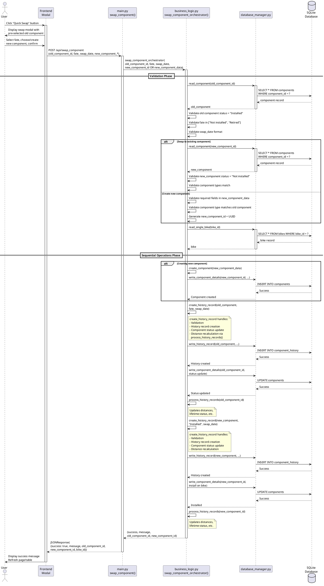
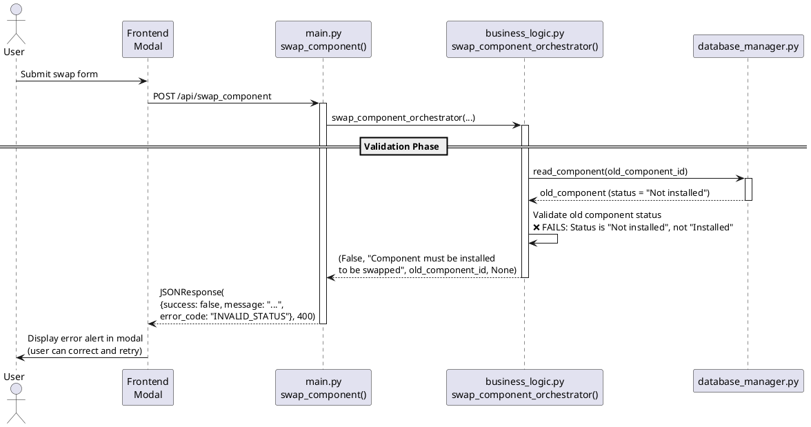

# Component Quick Swap - Architecture Handover

**Feature:** Component Quick Swap
**Date:** 2025-10-11 (Revised after stakeholder feedback)
**Status:** Complete - Ready for Implementation
**Prepared by:** @architect
**Ready for:** @fullstack-developer

**Revision Note:** This document was revised based on stakeholder feedback to:
- Simplify approach by leveraging `create_history_record()` for ALL updates (validation, status, distances)
- Remove automatic rollback - rely on validation to prevent failures
- Use modal-only feedback pattern (NO toast) following collections pattern exactly
- Simplify route naming: `/quick_swap` (not `/api/quick_swap`)
- Place orchestrator function before `create_collection()` in business_logic.py
- Remove complex transaction management (single-user system with sequential operations)

---

## Executive Summary

This document defines the technical architecture for the Component Quick Swap feature, which allows users to replace one installed component with another in a streamlined operation. The architecture leverages existing patterns from the Velo Supervisor 2000 codebase, particularly `create_history_record()` which handles all necessary validations, updates, and distance recalculations.

**Key Architectural Decisions:**
1. Single orchestrator endpoint `/quick_swap` handles both "swap to existing" and "create new component" scenarios
2. Leverage `create_history_record()` for ALL updates - it already handles validation, status changes, and distance recalculation
3. Orchestrator validates only component type matching (not already in `create_history_record`)
4. Modal-only user feedback (NO toast) following collections pattern exactly
5. Two separate history records created (no special "swap" record type)
6. No automatic rollback - robust validation prevents failures, user manually corrects if needed

**UX Designer Status:** ✅ Complete - UX handover available at `.handovers/ux/component-quick-swap-ux-designer-handover.md`. Architecture has been verified against existing endpoints and is ready for implementation.

---

## Context

### Requirements Source
- **Requirements Document:** `.handovers/requirements/component-quick-swap-requirements.md`
- **Primary Use Cases:** Worn component replacement, seasonal swaps, component rotation
- **Access Points:** Component overview page, bike details page, component details page

### Current System Patterns
The existing codebase has established patterns we'll follow:

**Component Status Changes:**
- Current approach: User navigates to component detail page, updates status via modal
- Route: `POST /add_history_record` (line 233 in `backend/main.py`)
- Business logic: `business_logic.create_history_record()` (line 1188 in `backend/business_logic.py`)
- Pattern: Form submission → validation → database transaction → history record → status recalculation

**Component Creation:**
- Route: `POST /create_component` (line 167 in `backend/main.py`)
- Business logic: `business_logic.create_component()` (line 1041 in `backend/business_logic.py`)
- Pattern: Form submission → data normalization → component creation → history record (if installed)

**Transaction Handling:**
- Pattern: Operations handled sequentially by existing methods (primarily `create_history_record`)
- Single-user system: No race condition concerns or complex transaction management needed
- Error handling: Return JSON response with success/message for user feedback via modal (matches collections pattern)
- No automatic rollback: User must handle failures manually via GUI feedback
- Focus on robust validation (frontend and backend) to minimize failure scenarios

---

## Architecture Overview

### High-Level Design

The quick swap feature introduces a new **orchestrator pattern** that coordinates multiple existing operations into a single atomic transaction. This differs from existing patterns where operations are discrete and sequential.

**Architecture Layers:**
```
┌─────────────────────────────────────────────────────────────┐
│ Frontend Layer (Jinja2 + JavaScript)                        │
│ - Quick Swap Modal (new)                                    │
│ - Form validation and submission                            │
└────────────────────────┬────────────────────────────────────┘
                         │
                         │ POST /quick_swap
                         ↓
┌─────────────────────────────────────────────────────────────┐
│ API Layer (main.py)                                          │
│ - New route: quick_swap()                                   │
│ - Request validation and parsing                            │
└────────────────────────┬────────────────────────────────────┘
                         │
                         │ quick_swap_orchestrator()
                         ↓
┌─────────────────────────────────────────────────────────────┐
│ Business Logic Layer (business_logic.py)                    │
│ - NEW: quick_swap_orchestrator()                            │
│ - REUSE: create_component() [if creating new]              │
│ - REUSE: create_history_record() [2x - old + new]          │
│   (create_history_record handles ALL validation,           │
│    updates, and distance recalculation via                  │
│    process_history_records)                                 │
└────────────────────────┬────────────────────────────────────┘
                         │
                         │ Sequential operations
                         ↓
┌─────────────────────────────────────────────────────────────┐
│ Database Layer (database_manager.py)                        │
│ - write_component_details() [if creating new]               │
│ - write_history_record() [2x - old + new]                  │
└─────────────────────────────────────────────────────────────┘
```

**Key Principle:** Maximize reuse of existing, tested functions rather than duplicating logic.

---

## API Design

### New Endpoint: Component Quick Swap

**Path:** `POST /quick_swap`

**Purpose:** Orchestrate swap of one installed component with another (existing or newly created)

**Location:** Add to `backend/main.py` after line 263 (after existing `/update_history_record` endpoint, before `/add_collection`)

**Request Schema:**

```python
@app.post("/quick_swap")
async def quick_swap(
    old_component_id: str = Form(...),
    fate: str = Form(...),  # "Not installed" or "Retired" - user-friendly name
    swap_date: str = Form(...),  # User-friendly name for the swap timestamp
    new_component_id: Optional[str] = Form(None),  # Present if swapping to existing
    # Fields below present ONLY if creating new component:
    create_new: Optional[str] = Form(None),  # "true" if creating new
    new_component_name: Optional[str] = Form(None),
    new_component_type: Optional[str] = Form(None),
    new_service_interval: Optional[str] = Form(None),
    new_lifetime_expected: Optional[str] = Form(None),
    new_cost: Optional[str] = Form(None),
    new_notes: Optional[str] = Form(None)
):
    """Endpoint to swap one component with another

    Note: Parameter names use user-friendly terms (fate, swap_date) which are
    mapped internally to business logic parameter names (installation_status,
    component_updated_date) when calling create_history_record().
    """
```

**Request Body Example (Swap to Existing):**
```
old_component_id: "abc-123"
fate: "Retired"
swap_date: "2025-10-11 14:30"
new_component_id: "def-456"
```

**Request Body Example (Create New):**
```
old_component_id: "abc-123"
fate: "Not installed"
swap_date: "2025-10-11 14:30"
create_new: "true"
new_component_name: "Shimano Ultegra Brake Pads"
new_component_type: "Brake Pads"
new_service_interval: "2000"
new_lifetime_expected: "2500"
new_cost: "450"
new_notes: "Front brake pads"
```

**Response Schema:**

**Success (200):**
```json
{
  "success": true,
  "message": "Component swapped successfully: Old component [Old Name] set to [Fate], new component [New Name] installed on [Bike Name]"
}
```

**Error (200):**
```json
{
  "success": false,
  "message": "Components must be of the same type. Cannot swap Brake Pads with Saddle."
}
```

**Note:** Following the collections pattern, all responses return JSON with `success` and `message` fields. Frontend modal displays all user feedback (both success and errors) - NO toast notifications for this feature.

---

## Database Architecture

### Tables Affected

**1. `components` table (Components model)**
- **Fields modified per swap:**
  - Old component: `installation_status`, `bike_id`, `updated_date`
  - New component (if existing): `installation_status`, `bike_id`, `updated_date`
  - New component (if created): All fields initialized

**2. `component_history` table (ComponentHistory model)**
- **Records created per swap:** 2 records (one for old component, one for new)
- **Fields per record:**
  - `history_id`: UUID (generated)
  - `component_id`: UUID (old or new component)
  - `bike_id`: UUID (inherited from old component)
  - `component_name`: String (component name at time of swap)
  - `updated_date`: String (user-specified swap date)
  - `update_reason`: String ("Retired", "Not installed", or "Installed")
  - `distance_marker`: Float (bike total_distance at time of swap)

### Operation Design

**Sequential Operations:** Database operations handled sequentially by existing methods.

**Operation Flow:**
```python
# 1. Validate inputs (component exists, types match, etc.)
# 2. If creating new component: Call create_component()
# 3. Call create_history_record() for old component (uninstall/retire)
#    - create_history_record handles ALL: validation, status updates, distance updates
# 4. Call create_history_record() for new component (install)
#    - create_history_record handles ALL: validation, status updates, distance updates
# 5. Return success/failure with message for modal display
```

**Error Handling:**
- Validation failures return immediately with error message
- If operation fails partway through, user sees error via modal (NOT toast)
- No automatic rollback - user manually corrects via GUI
- Robust frontend and backend validation minimize failure scenarios

### Schema Changes Required

**None.** The existing database schema fully supports the quick swap operation. No migration needed.

---

## Business Logic Architecture

### New Function: quick_swap_orchestrator()

**Location:** `backend/business_logic.py` (add just before `create_collection()` function, around line 1473)

**Note:** Docstrings should be simplified and consistent with existing codebase patterns (see other functions in business_logic.py)

**Signature:**
```python
def quick_swap_orchestrator(self,
                             old_component_id: str,
                             fate: str,
                             swap_date: str,
                             new_component_id: Optional[str] = None,
                             new_component_data: Optional[dict] = None) -> tuple[bool, str]:
    """Method to orchestrate swap of one component with another

    Args:
        old_component_id: Component being replaced
        fate: "Not installed" or "Retired" (maps to installation_status)
        swap_date: Timestamp of swap (maps to component_updated_date)
        new_component_id: ID of existing component to install (optional)
        new_component_data: Dict with new component details (optional)

    Returns:
        Tuple of (success: bool, message: str)

    Note: Parameters fate/swap_date are user-friendly names that get passed
    directly to create_history_record() as installation_status/component_updated_date.
    """
```

**Orchestration Logic:**

```python
def quick_swap_orchestrator(self, old_component_id, fate, swap_date,
                             new_component_id=None, new_component_data=None):
    """Method to orchestrate swap of one component with another"""
    try:
        old_component = database_manager.read_component(old_component_id)
        if not old_component:
            return False, "Component not found"

        if old_component.installation_status != "Installed":
            return False, "Component must be installed to be swapped"

        if fate not in ["Not installed", "Retired"]:
            return False, "Invalid fate selection"

        bike_id = old_component.bike_id
        if not bike_id:
            return False, "Old component has no bike assignment"

        if new_component_id:
            new_component = database_manager.read_component(new_component_id)
            if not new_component:
                return False, "Selected component not found"

            if new_component.installation_status != "Not installed":
                return False, "Selected component is not available for installation"

            if old_component.component_type != new_component.component_type:
                return False, f"Components must be of the same type. Cannot swap {old_component.component_type} with {new_component.component_type}."

        elif new_component_data:
            if not new_component_data.get("component_name"):
                return False, "Component name is required"

            if new_component_data.get("component_type") != old_component.component_type:
                return False, f"New component type must match old component type: {old_component.component_type}"

            success, message, new_component_id = self.create_component(
                component_id=None,
                component_installation_status="Not installed",
                component_updated_date=swap_date,
                component_name=new_component_data["component_name"],
                component_type=new_component_data["component_type"],
                component_bike_id=None,
                expected_lifetime=new_component_data.get("lifetime_expected"),
                service_interval=new_component_data.get("service_interval"),
                cost=new_component_data.get("cost"),
                offset=0,
                component_notes=new_component_data.get("notes", ""))

            if success == False:  # Explicit False check (success can be True, False, or "warning")
                return False, f"Failed to create new component: {message}"
            elif success == "warning":
                logging.warning(f"Component created with warning: {message}")
                # Continue with swap - component was created successfully

        else:
            return False, "Must provide either new_component_id or new_component_data"

        # Uninstall/retire old component
        # Note: fate ("Not installed"/"Retired") maps to installation_status parameter
        # swap_date maps to component_updated_date parameter
        success, message = self.create_history_record(
            component_id=old_component_id,
            installation_status=fate,  # "Not installed" or "Retired"
            component_bike_id=bike_id,
            component_updated_date=swap_date)

        if not success:
            return False, f"Failed to update old component: {message}"

        # Install new component
        success, message = self.create_history_record(
            component_id=new_component_id,
            installation_status="Installed",
            component_bike_id=bike_id,
            component_updated_date=swap_date)

        if not success:
            return False, f"Failed to install new component: {message}"

        old_component_refreshed = database_manager.read_component(old_component_id)
        new_component_refreshed = database_manager.read_component(new_component_id)
        bike = database_manager.read_single_bike(bike_id)

        message = f"Component swapped successfully: {old_component_refreshed.component_name} set to {fate}, {new_component_refreshed.component_name} installed on {bike.bike_name}"
        logging.info(message)

        return True, message

    except Exception as error:
        logging.error(f"Swap operation failed: {str(error)}")
        return False, f"Swap operation failed: {str(error)}"
```

**Design Rationale:**
- **Leverage existing methods:** `create_component()` and `create_history_record()` handle ALL validations, updates, and distance recalculations
- **Minimal orchestration logic:** Validates only what `create_history_record` doesn't (component type matching), then calls existing methods in sequence
- **No redundant operations:** NO calls to `update_component_distance()` - already handled by `create_history_record` → `process_history_records`
- **Simple error handling:** Return success/failure messages for modal display (NO toast)

### Supporting Functions (Reuse Existing)

**No new supporting functions needed.** The orchestrator leverages:
- `database_manager.read_component()` - Read component details
- `database_manager.read_single_bike()` - Read bike details
- `business_logic.create_component()` - Create new component (if needed)
- `business_logic.create_history_record()` - Handle status changes, validation, and distance updates
  - This function already calls `process_history_records()` which updates all distances
  - NO need to call `update_component_distance()` separately

---

## Data Flow Architecture

### Sequence Diagram: Component Quick Swap Operation



### Error Flow: Validation Failure



**Note:** Race condition diagram removed - single-user system with sequential operations makes complex transaction management unnecessary.

---

## Error Handling Strategy

### Error Categories and User Feedback

Following the collections pattern, all responses return JSON with `success` and `message` fields. All user feedback (success and errors) is shown via modal - NO toast notifications.

| Error Category | Example Scenario | User Action |
|----------------|------------------|-------------|
| **Validation Error** | Component type mismatch | User must select matching type |
| **Not Found Error** | Old component doesn't exist | User should refresh page |
| **Conflict Error** | New component already installed | User must select different component |
| **Server Error** | Database operation failure | User should retry |

### Validation Rules

**Orchestrator Validation (Additional to create_history_record):**
1. Old component exists → Return error if not found
2. Old component status = "Installed" → Return error if not
3. Fate in ["Not installed", "Retired"] → Return error if invalid
4. New component exists (if selecting existing) → Return error if not found
5. New component status = "Not installed" (if selecting existing) → Return error if not available
6. Component types match → Return error if mismatch (this is NEW validation not in create_history_record)
7. Required fields present (if creating new) → Return error if missing
8. Bike exists and is accessible → Return error if not found

**Note:** `create_history_record()` performs additional validation (date format, component changes, etc.) - DO NOT duplicate these checks in the orchestrator.

### Error Messages

**User-Facing Messages (Frontend Display):**
- Clear, actionable language
- No technical jargon
- Suggest corrective action

**Examples:**
- ✅ "Selected component is no longer available. It may have been installed on another bike."
- ❌ "Peewee IntegrityError: UNIQUE constraint failed"

**Developer Messages (Logs):**
- Technical details
- Stack traces
- Request IDs for debugging

**Log Format:**
```python
logging.error(f"Swap operation failed for user request: old_component_id={old_component_id}, new_component_id={new_component_id}, error={str(error)}")
```

### Frontend Error Handling

**Error Display Pattern (Follow Collections Pattern EXACTLY):**
```javascript
// In quick swap modal JavaScript - follow collections pattern
fetch('/quick_swap', {
    method: 'POST',
    body: formData
})
.then(response => response.json())
.then(data => {
    // Close loading modal
    forceCloseLoadingModal();

    // Show results in report modal after delay
    setTimeout(() => {
        const title = data.success ? '✅ Swap complete' : '❌ Swap failed';
        showReportModal(title, data.message, data.success, false, function() {
            // Refresh page after user dismisses modal
            window.location.reload();
        });
    }, 500);
})
.catch(error => {
    // Network error: Show error in report modal
    forceCloseLoadingModal();
    setTimeout(() => {
        showReportModal('❌ Application error',
                       'An error occurred. Please try again.',
                       false, false, function() {
            window.location.reload();
        });
    }, 400);
});
```

**User Feedback Pattern:**
- **ALL feedback** (success and errors) shown via modal using `showReportModal()`
- **NO toast notifications** for this feature
- **Loading modal** shows spinner during operation
- **Report modal** shows final result with option to dismiss
- Follow collections pattern at `/home/xivind/code/velo-supervisor-2000/frontend/static/js/main.js` lines 1966-2046

---

## Integration with Existing Code

### Files to Modify

**1. `backend/main.py`**
- **Location:** After line 263 (after `/update_history_record` endpoint, before `/add_collection`)
- **Action:** Add new endpoint `quick_swap()`
- **Pattern to follow:** Collections pattern `/change_collection_status` (line 303-315) - JSON response with success/message

**Code Template:**
```python
@app.post("/quick_swap")
async def quick_swap(
    old_component_id: str = Form(...),
    fate: str = Form(...),
    swap_date: str = Form(...),
    new_component_id: Optional[str] = Form(None),
    create_new: Optional[str] = Form(None),
    new_component_name: Optional[str] = Form(None),
    new_component_type: Optional[str] = Form(None),
    new_service_interval: Optional[str] = Form(None),
    new_lifetime_expected: Optional[str] = Form(None),
    new_cost: Optional[str] = Form(None),
    new_notes: Optional[str] = Form(None)
):
    """Endpoint to swap one component with another"""

    if create_new == "true":
        new_component_data = {
            "component_name": new_component_name,
            "component_type": new_component_type,
            "service_interval": new_service_interval,
            "lifetime_expected": new_lifetime_expected,
            "cost": new_cost,
            "notes": new_notes
        }
        success, message = business_logic.quick_swap_orchestrator(
            old_component_id, fate, swap_date, new_component_data=new_component_data
        )
    else:
        success, message = business_logic.quick_swap_orchestrator(
            old_component_id, fate, swap_date, new_component_id=new_component_id
        )

    return JSONResponse({"success": success, "message": message})
```

**Note:** Follow collections pattern EXACTLY - simple JSON response, no status code logic, all feedback via modal.

**2. `backend/business_logic.py`**
- **Location:** Just before `create_collection()` function (around line 1473)
- **Action:** Add new function `quick_swap_orchestrator()`
- **Pattern to follow:** Simple orchestration that calls existing methods in sequence

**Reference existing patterns:**
- Component creation: `create_component()` (line 1041) - handles component creation with validation
- History recording: `create_history_record()` (line 1188) - handles ALL status updates, validation, distance recalculation
- Collections status change: `change_collection_status()` (line 1596) - simple orchestration calling `create_history_record()` for each component

**3. Frontend Templates (TBD by @ux-designer)**
- **Files to modify:**
  - `frontend/templates/component_overview.html` (add Quick Swap button)
  - `frontend/templates/bike_details.html` (add Quick Swap button)
  - `frontend/templates/component_details.html` (add Quick Swap button)
- **New template:** `frontend/templates/modal_quick_swap.html`
- **Pattern to follow:** Existing modal patterns like `modal_update_component_status.html`

**4. Frontend JavaScript (TBD by @ux-designer)**
- **File to create:** `frontend/static/js/quick_swap.js`
- **Actions:**
  - Modal population (pre-fill old component)
  - Form submission (AJAX POST to `/api/swap_component`)
  - Response handling (success toast, error alert, table refresh)
  - Dynamic form display (toggle between "select existing" and "create new")
- **Pattern to follow:** Existing JavaScript for modal forms

### Database Manager Functions (Reuse Existing)

**No new database manager functions needed.** Reuse:
- `read_component(component_id)` - line 183
- `read_single_bike(bike_id)` - line 28
- `write_component_details(component_id, data)` - line 362
- `write_history_record(history_data)` - line 438

### Business Logic Functions (Reuse Existing)

**Reuse these functions:**
- `create_component()` - Create new component (line 1041)
- `create_history_record()` - Handle ALL status changes, validation, distance updates (line 1188)
  - Already calls `process_history_records()` which updates distances
  - Already handles date validation
  - Already updates component status
  - Already creates history records
- DO NOT call `update_component_distance()` separately - already handled by `create_history_record()`

---

## Component Health Warnings

### Warning Logic

**Warning Thresholds (from requirements):**
- Lifetime warning: `lifetime_remaining <= 500` km
- Service warning: `service_next <= 100` km

**Implementation Approach:**

**Option A: Frontend-only warnings (RECOMMENDED)**
- Frontend JavaScript calculates warnings when user selects new component
- Warnings displayed immediately in modal
- No server-side validation (warnings are informational, not blocking)
- Simpler architecture, faster user feedback

**Option B: Backend-provided warnings**
- Backend returns warning flags in API response
- Frontend displays warnings based on response
- More complex, but provides consistent warning logic

**Recommendation:** Option A (Frontend-only)

**Rationale:**
- Warnings are non-blocking, so no server-side enforcement needed
- Component data already available in modal (lifetime_remaining, service_next)
- Faster user feedback (no network round-trip)
- Consistent with existing frontend validation patterns

**Frontend Implementation (for @ux-designer):**
```javascript
// When user selects a component from "swap to" dropdown
function checkComponentHealth(component) {
    let warnings = [];

    if (component.lifetime_remaining !== null && component.lifetime_remaining <= 500) {
        warnings.push({
            type: 'lifetime',
            message: `This component has only ${component.lifetime_remaining} km remaining before end of life. Are you sure you want to install it?`
        });
    }

    if (component.service_next !== null && component.service_next <= 100) {
        warnings.push({
            type: 'service',
            message: `This component needs service in ${component.service_next} km. Consider servicing before installation.`
        });
    }

    displayWarnings(warnings);  // Display in modal UI
}
```

---

## Performance Considerations

### Database Query Optimization

**Dropdown Queries (for frontend):**

**Current Pattern (inefficient):**
```python
# Load ALL components, filter in Python
all_components = database_manager.read_all_components()
not_installed = [c for c in all_components if c.installation_status == "Not installed"]
```

**Optimized Pattern (use SQL WHERE):**
```python
# New database_manager function for fullstack-developer to implement
def read_components_by_status_and_type(status, component_type):
    """Method to read components filtered by status and type"""
    return (Components
            .select()
            .where((Components.installation_status == status) &
                   (Components.component_type == component_type))
            .order_by(Components.component_name))
```

**Index Recommendations:**

**Current indexes (from database schema):**
- `component_id` (primary key, indexed by default)

**Recommended new indexes (for @database-expert if needed):**
- Composite index on `(installation_status, component_type)` for efficient dropdown queries
- Single index on `installation_status` if frequently querying by status alone

**Note:** SQLite auto-indexes primary keys. For a typical user with <1000 components, indexes may not be necessary. Evaluate after MVP launch based on performance profiling.

### Operation Performance

**Sequential Operations:** Operations handled in sequence by existing methods.

**Operation Flow:**
1. Validation (quick, in-memory)
2. Optional: Create new component (if needed)
3. Update old component via `create_history_record()` (includes distance update)
4. Update new component via `create_history_record()` (includes distance update)

**Rationale:** Single-user system with sequential operations. No complex transaction management needed. `create_history_record()` handles all necessary updates efficiently.

### Scalability Notes

**Current Scale:** Single-user application with local SQLite database

**Concurrency:** Low (one user, occasional multi-tab scenarios)

**Future Considerations (post-MVP):**
- Large component lists (1000+) may benefit from pagination or search-as-you-type in dropdowns
- Audit log of swap operations if needed for tracking

---

## Testing Strategy

### Test Scenarios for @fullstack-developer

**Unit Tests (Backend):**
1. `quick_swap_orchestrator()` with valid inputs (swap to existing)
2. `quick_swap_orchestrator()` with valid inputs (create new)
3. Validation failure: old component not found
4. Validation failure: old component not installed
5. Validation failure: new component not found
6. Validation failure: new component already installed
7. Validation failure: component type mismatch (NEW validation in orchestrator)
8. Validation failure: invalid date format (handled by create_history_record)
9. Database error handling (return error message for modal display)

**Integration Tests (Full Stack):**
1. POST to `/quick_swap` with valid data (swap to existing)
2. POST to `/quick_swap` with valid data (create new)
3. Verify two history records created
4. Verify old component status updated correctly
5. Verify new component status updated correctly
6. Verify bike context preserved
7. Verify distance recalculation triggered (via process_history_records)
8. Verify JSON response format (success/message fields)

**Manual Testing Checklist:**
- [ ] Quick swap from component overview page
- [ ] Quick swap from bike details page
- [ ] Quick swap from component details page
- [ ] Swap to existing "Not installed" component
- [ ] Create new component during swap with copied settings
- [ ] Default fate selection (Retired when lifetime reached)
- [ ] Override default fate selection
- [ ] Component type validation (prevent type mismatch)
- [ ] Health warnings display (lifetime/service near threshold)
- [ ] Error handling (component not found, already installed, etc.)
- [ ] Success feedback and table refresh
- [ ] History records appear correctly on component detail pages
- [ ] Distance tracking continues correctly after swap
- [ ] Bike compliance report updates correctly

### Test Data Setup

**Prerequisites:**
- At least 2 bikes in database
- At least 5 components of same type (e.g., "Brake Pads")
  - 2 with `installation_status = "Installed"` (on different bikes)
  - 2 with `installation_status = "Not installed"`
  - 1 with `installation_status = "Retired"`
- At least 1 component near end of life (for warning testing)
- At least 1 component needing service soon (for warning testing)

---

## Risks and Mitigations

### Risk 1: Partial Operation Failure

**Risk:** One component updated successfully, other fails

**Likelihood:** Low (robust validation minimizes failures)

**Impact:** Medium (inconsistent component states - user must manually correct)

**Mitigation:**
- Comprehensive frontend and backend validation prevents most failure scenarios
- If failure occurs, clear error message displayed via modal
- User manually corrects issue and retries
- No automatic rollback - keep it simple for single-user system

**Testing:** Test error scenarios (component not found, already installed, etc.) and verify clear error messages

---

### Risk 2: Frontend-Backend Synchronization

**Risk:** Frontend cache shows outdated component data

**Likelihood:** Medium (if page not refreshed after previous operation)

**Impact:** Medium (user attempts invalid swap, receives error)

**Mitigation:**
- Backend validation always checks current database state
- Clear error messages displayed via modal
- Frontend refreshes page after successful operations
- Modal feedback guides user to retry or refresh

**Testing:** Perform swap, do not refresh page, attempt second swap with stale data

---

### Risk 3: Component Type Mismatch

**Risk:** User attempts to swap incompatible component types (e.g., brake pads with saddle)

**Likelihood:** Low (frontend filters dropdown by type)

**Impact:** Low (validation catches it, clear error message)

**Mitigation:**
- Frontend filters dropdown to show only matching component types
- Backend validates component types match (orchestrator validation)
- Clear error message displayed via modal
- User can correct selection and retry

**Testing:** Bypass frontend validation (e.g., manual API call) and verify backend catches mismatch

---

### Risk 4: Performance Degradation

**Risk:** Slow query performance with large component lists (1000+ components)

**Likelihood:** Low (typical users have <100 components)

**Impact:** Medium (dropdown loading slow, poor UX)

**Mitigation:**
- Use SQL filtering instead of Python filtering (WHERE clauses)
- Add database indexes if needed (after profiling)
- Consider pagination or search-as-you-type for large datasets
- Monitor query performance post-launch

**Testing:** Load test with 1000+ components, measure dropdown population time


---

## UX Implications and Constraints

### API Constraints Affecting UI Design

**1. Component Selection Pre-Filtering**
- **Constraint:** Backend expects new component to match old component's type
- **UI Impact:** @ux-designer should filter "swap to" dropdown to show only matching types
- **Data Available:** Old component's `component_type` field
- **Implementation:** Frontend JavaScript filters component list before populating dropdown

**2. Bike Context Display**
- **Constraint:** Bike is always inherited from old component (no bike selection)
- **UI Impact:** Display bike name prominently (read-only, not editable)
- **Data Available:** Old component's `bike_id` → Bike name from bikes table
- **Implementation:** Display as informational field: "Swapping component on: [Bike Name]"

**3. Date Validation**
- **Constraint:** Swap date cannot be in future
- **UI Impact:** Date picker should prevent future date selection
- **Data Available:** Current date/time
- **Implementation:** Date picker max date = today

**4. Component Health Warnings**
- **Constraint:** Warning thresholds defined (lifetime ≤ 500km, service ≤ 100km)
- **UI Impact:** Display warnings when selecting component from dropdown
- **Data Available:** Component's `lifetime_remaining` and `service_next` fields
- **Implementation:** JavaScript checks values and displays Bootstrap alert banners

**5. Create New Component Field Locking**
- **Constraint:** Component type must match old component (not editable)
- **UI Impact:** Component type field should be pre-filled and disabled
- **Data Available:** Old component's `component_type`
- **Implementation:** `<input type="text" value="{{old_component.component_type}}" disabled>`

### Response Handling Requirements

**Success Response:**
- Close modal
- Display success toast/notification
- Refresh component table (show updated statuses)
- Optional: Redirect to bike details or component details page

**Error Response:**
- Keep modal open
- Display error alert at top of modal
- Allow user to correct input and retry
- Do not lose user's input (unless validation requires it)

**Loading State:**
- Display loading spinner during API request
- Disable submit button to prevent double-submission
- Use same pattern as existing modals (e.g., modal_update_component_status.html)

### Data Format Requirements

**Component Dropdown Format:**
- Display: "[Component Name] ([Distance] km)"
- Example: "Shimano Ultegra Brake Pads (250 km)"
- Data attributes: `data-component-id`, `data-lifetime-remaining`, `data-service-next` (for warnings)

**Date Format:**
- Input format: "YYYY-MM-DD HH:MM"
- Use existing datepicker pattern (see modal_update_component_status.html line 34-38)
- Calendar icon toggle: 🗓 emoji

**Fate Selection:**
- Radio buttons or select dropdown (UX designer's choice)
- Options: "Not installed", "Retired"
- Default logic: If `component_distance >= lifetime_expected` then default = "Retired", else "Not installed"

---

## Architecture Decision Records

### ADR-1: Single Orchestrator Endpoint vs. Separate Endpoints

**Decision:** Use single orchestrator endpoint `POST /api/swap_component` for both scenarios (swap to existing, create new)

**Context:** Requirements specify two scenarios: swap to existing component OR create new component during swap

**Alternatives Considered:**
- **Option A:** Single endpoint with conditional logic (chosen)
- **Option B:** Two separate endpoints (`/api/swap_to_existing`, `/api/swap_create_new`)

**Rationale:**
- Both scenarios perform the same core operation (atomic swap)
- Differentiation is based on presence of `new_component_id` vs. `new_component_data`
- Single endpoint simplifies frontend logic (one form submission handler)
- Consistent with existing patterns (e.g., `create_component` handles create/update)

**Consequences:**
- Orchestrator function must handle conditional logic (if/else for scenario detection)
- Request payload has optional fields (some mutually exclusive)
- Clearer API surface (one swap endpoint, not two)

---

### ADR-2: Leverage create_history_record for All Updates

**Decision:** Use `create_history_record()` for all component status changes, distance updates, and validation

**Context:** Need to update component statuses and distances during swap operation

**Alternatives Considered:**
- **Option A:** Orchestrator calls `create_history_record()` which handles everything (chosen)
- **Option B:** Orchestrator directly updates components and calls `update_component_distance()`

**Rationale:**
- `create_history_record()` already handles ALL necessary operations:
  - Validation (dates, component changes)
  - History record creation
  - Component status updates
  - Distance recalculation via `process_history_records()`
- Reusing existing, tested methods reduces code duplication
- Consistent with collections pattern (see `change_collection_status()` line 1596)
- Stakeholder feedback: "calling `create_history_record` is sufficient"

**Consequences:**
- Simplified orchestrator - primarily validates component type matching
- No redundant distance update calls
- Consistent behavior with rest of application
- Less code to maintain and test

---

### ADR-3: History Record Strategy - Separate vs. Linked Records

**Decision:** Create two separate, unlinked history records (no special "swap" indicator)

**Context:** Requirements specify swap operation creates two history records

**Alternatives Considered:**
- **Option A:** Two separate records with matching timestamps (chosen)
- **Option B:** Two separate records with `swap_operation_id` linking field
- **Option C:** Single "swap" record with references to both components

**Rationale:**
- Option A matches existing pattern (history records are independent)
- No schema change required (reuse existing ComponentHistory model)
- Simplest implementation (reuse `write_history_record()` function twice)
- Relationship implied by matching timestamp and bike_id (sufficient for MVP)
- Option B adds complexity (new field, migration needed) without clear benefit
- Option C breaks existing history display logic (expects one component per record)

**Consequences:**
- History records appear as independent events (not explicitly linked)
- Users can infer relationship by matching timestamps
- Future enhancement: Add visual indicator in history display (e.g., "swapped" badge)
- No database migration required for MVP

---

### ADR-4: Component Type Validation - Frontend vs. Backend

**Decision:** Enforce component type validation at both frontend (UX) and backend (security)

**Context:** Requirements mandate strict type matching (cannot swap brake pads with saddle)

**Alternatives Considered:**
- **Option A:** Frontend-only validation (simpler, but insecure)
- **Option B:** Backend-only validation (secure, but poor UX)
- **Option C:** Both frontend and backend validation (chosen)

**Rationale:**
- Frontend validation provides immediate feedback (no network round-trip)
- Backend validation ensures security (cannot bypass via API calls)
- Consistent with existing patterns (e.g., required field validation)
- Minimal additional complexity

**Consequences:**
- Frontend filters dropdown to show only matching component types
- Backend validates types match before transaction
- Potential for duplicate logic, but necessary for security
- Clear separation: Frontend improves UX, backend enforces data integrity

---

### ADR-5: Modal-Based User Feedback (No Toast)

**Decision:** All user feedback (success and errors) shown via modal, following collections pattern exactly

**Context:** Need consistent user feedback pattern for swap operations

**Alternatives Considered:**
- **Option A:** Modal for all feedback (chosen) - matches collections pattern
- **Option B:** Toast for success, modal for errors
- **Option C:** Toast for all feedback

**Rationale:**
- Stakeholder feedback: "Follow the collections pattern EXACTLY for ALL user feedback"
- Collections feature uses modal exclusively (no toast) - see `change_collection_status()` implementation
- Modal feedback flow:
  1. Show loading modal with spinner
  2. Close loading modal when operation completes
  3. Show report modal with success/error message
  4. User dismisses modal, page refreshes
- Consistent UX across similar bulk operations
- Existing `showReportModal()` function already handles success/error styling

**Consequences:**
- NO toast notifications for this feature
- All JavaScript follows collections pattern at `/home/xivind/code/velo-supervisor-2000/frontend/static/js/main.js` lines 1966-2046
- Loading and report modals provide clear feedback
- Page refresh after modal dismissal ensures fresh data

---

## Task Breakdown for Implementation

### Phase 1: Backend Implementation

**Task 1.1: Create Orchestrator Function**
- **File:** `backend/business_logic.py`
- **Location:** After `create_history_record()` (line ~1243)
- **Deliverable:** `swap_component_orchestrator()` function
- **Estimated Complexity:** High (100-150 lines)
- **Dependencies:** None
- **Testing:** Unit tests for validation logic, transaction handling, error scenarios

**Task 1.2: Create API Endpoint**
- **File:** `backend/main.py`
- **Location:** After `/add_history_record` (line ~249)
- **Deliverable:** `POST /api/swap_component` route handler
- **Estimated Complexity:** Medium (30-50 lines)
- **Dependencies:** Task 1.1 complete
- **Testing:** Integration tests for request/response handling, HTTP status codes

**Task 1.3: Add Database Query Helper (Optional)**
- **File:** `backend/database_manager.py`
- **Location:** After existing read functions (line ~200)
- **Deliverable:** `read_components_by_status_and_type()` function
- **Estimated Complexity:** Low (10-15 lines)
- **Dependencies:** None
- **Testing:** Query performance with various filters
- **Note:** Optional optimization, can use existing `read_all_components()` for MVP

---

### Phase 2: Frontend Implementation (Pending @ux-designer)

**Note:** Tasks below are placeholders. @fullstack-developer should read UX handover before implementing.

**Task 2.1: Create Quick Swap Modal Template**
- **File:** `frontend/templates/modal_quick_swap.html` (new file)
- **Pattern to follow:** `modal_update_component_status.html`
- **Deliverable:** Modal HTML with form fields
- **Estimated Complexity:** Medium (150-200 lines)
- **Dependencies:** UX specifications from @ux-designer
- **Testing:** Visual review, accessibility (keyboard navigation, screen reader)

**Task 2.2: Add Quick Swap Buttons to Tables**
- **Files:**
  - `frontend/templates/component_overview.html`
  - `frontend/templates/bike_details.html`
  - `frontend/templates/component_details.html`
- **Deliverable:** "Quick Swap" button/link in appropriate locations
- **Estimated Complexity:** Low (5-10 lines per file)
- **Dependencies:** UX specifications for button placement/styling
- **Testing:** Visual review, button visibility logic

**Task 2.3: Implement Quick Swap JavaScript**
- **File:** `frontend/static/js/quick_swap.js` (new file)
- **Deliverable:** JavaScript for modal interactions, form submission, response handling
- **Estimated Complexity:** High (200-300 lines)
- **Dependencies:** Tasks 2.1 and 2.2 complete
- **Testing:** Manual testing of all user flows, error scenarios, edge cases

**Task 2.4: Integrate Modal into Base Template**
- **File:** `frontend/templates/base.html` (or relevant parent template)
- **Deliverable:** Include modal template and JavaScript in pages
- **Estimated Complexity:** Low (5-10 lines)
- **Dependencies:** Tasks 2.1 and 2.3 complete
- **Testing:** Verify modal loads on all access point pages

---

### Phase 3: Testing and Validation

**Task 3.1: Backend Unit Tests**
- **File:** `backend/tests/test_swap_component.py` (new file)
- **Deliverable:** Comprehensive unit tests for orchestrator function
- **Estimated Complexity:** Medium (200-300 lines)
- **Dependencies:** Phase 1 complete
- **Test Coverage:** Validation logic, transaction handling, error scenarios, race conditions

**Task 3.2: Integration Tests**
- **File:** `backend/tests/test_api_swap.py` (new file)
- **Deliverable:** API endpoint tests (request/response, status codes, database state)
- **Estimated Complexity:** Medium (150-200 lines)
- **Dependencies:** Phase 1 complete
- **Test Coverage:** Full request/response cycle, database verification, error responses

**Task 3.3: Manual Testing**
- **Deliverable:** Completed manual testing checklist (see Testing Strategy section)
- **Estimated Complexity:** High (2-4 hours)
- **Dependencies:** Phase 2 complete
- **Test Coverage:** All user flows, edge cases, error handling, browser compatibility

**Task 3.4: Performance Testing (Optional)**
- **Deliverable:** Query performance benchmarks, transaction timing
- **Estimated Complexity:** Low (1 hour)
- **Dependencies:** Phase 1 and 2 complete
- **Test Coverage:** Large dataset scenarios (1000+ components)

---

### Phase 4: Documentation

**Task 4.1: Update API Documentation**
- **File:** API documentation (if exists) or inline code comments
- **Deliverable:** Document new `/api/swap_component` endpoint
- **Estimated Complexity:** Low (30 minutes)
- **Dependencies:** Phase 1 complete
- **Content:** Endpoint path, request schema, response schema, error codes

**Task 4.2: Update User Documentation**
- **File:** `frontend/templates/help.html` or user guide
- **Deliverable:** Instructions for using Quick Swap feature
- **Estimated Complexity:** Low (1 hour)
- **Dependencies:** Phase 2 complete
- **Content:** Feature description, access points, workflow steps, screenshots

**Task 4.3: Create Handover for Code Reviewer**
- **File:** `.handovers/fullstack/component-quick-swap-fullstack-to-reviewer.md`
- **Deliverable:** Implementation handover with testing evidence
- **Estimated Complexity:** Low (1 hour)
- **Dependencies:** Phase 3 complete
- **Content:** Implementation summary, files changed, testing results, known issues

---

## PlantUML Diagrams Summary

This handover includes the following PlantUML diagrams for clarity:

1. **Sequence Diagram: Component Quick Swap Operation**
   - Illustrates the full happy-path flow from user interaction through sequential operations
   - Shows validation phase and sequential operations phase (create_history_record calls)
   - Highlights data flow between frontend, API, business logic, and database layers
   - Demonstrates how `create_history_record()` handles all updates

2. **Error Flow: Validation Failure**
   - Demonstrates early validation failure scenario
   - Shows how errors are propagated to modal for user display
   - Illustrates fail-fast approach (validation before operations)

**Usage:** Copy PlantUML code blocks and render using PlantUML viewer or paste into online PlantUML editor (https://www.plantuml.com/plantuml/).

---

## Next Steps

### For @fullstack-developer

**Read Both Handovers:**
1. This architecture handover (API contracts, business logic)
2. UX handover at `.handovers/ux/component-quick-swap-ux-designer-handover.md` (UI specifications, interaction patterns)

**Implement in Order:**
1. Phase 1: Backend (orchestrator + API endpoint)
2. Phase 2: Frontend (modal + JavaScript, using UX specifications)
3. Phase 3: Testing (unit, integration, manual)
4. Phase 4: Documentation (API, user guide, code reviewer handover)

**Testing Checkpoints:**
- After Phase 1: Run backend unit tests, verify API endpoint with Postman/curl
- After Phase 2: Manual testing of all user flows
- Before handoff to reviewer: Complete manual testing checklist

**Create Handover:**
- File: `.handovers/fullstack/component-quick-swap-fullstack-to-reviewer.md`
- Include: Implementation summary, testing results, known issues, demo instructions

---

### For @code-reviewer (After @fullstack-developer Completes)

**Review Focus Areas:**
1. Transaction atomicity (verify rollback on errors)
2. Validation completeness (all edge cases handled)
3. Error messaging clarity (user-facing messages actionable)
4. Code consistency (follows existing patterns)
5. Testing coverage (unit tests, integration tests, manual testing evidence)
6. Security (component type validation, SQL injection prevention)

**Create Handover:**
- File: `.handovers/review/component-quick-swap-reviewer-to-docs.md`
- Include: Review findings, approved/revision-needed, commit message suggestions

---

## Appendix: Code Reference Locations

**Existing Patterns to Follow:**

| Pattern | File | Line | Description |
|---------|------|------|-------------|
| Form-based POST endpoint | `backend/main.py` | 233 | `/add_history_record` endpoint |
| Component creation logic | `backend/business_logic.py` | 1041 | `create_component()` function |
| History record creation | `backend/business_logic.py` | 1188 | `create_history_record()` function |
| Transaction management | `backend/database_manager.py` | 303 | `write_update_rides_bulk()` with `database.atomic()` |
| Component status update | `backend/business_logic.py` | 777 | `update_component_lifetime_status()` |
| Modal template pattern | `frontend/templates/modal_update_component_status.html` | 1-48 | Status update modal |
| Date picker pattern | `frontend/templates/modal_update_component_status.html` | 34-38 | Date input with calendar icon |
| Form validation pattern | `backend/business_logic.py` | 1198 | `validate_history_record()` call |
| JSON response pattern | `backend/main.py` | 315 | `change_collection_status()` response |

**Database Models:**

| Model | File | Line | Description |
|-------|------|------|-------------|
| Components | `backend/database_model.py` | 65-86 | Component table schema |
| ComponentHistory | `backend/database_model.py` | 104-116 | History table schema |
| Bikes | `backend/database_model.py` | 22-33 | Bike table schema |

**Utility Functions:**

| Function | File | Line | Description |
|----------|------|------|-------------|
| `generate_unique_id()` | `backend/utils.py` | - | UUID generation |
| `validate_date_format()` | `backend/utils.py` | - | Date validation |
| `get_formatted_datetime_now()` | `backend/utils.py` | - | Current timestamp |

---

## Architectural Verification (2025-10-12)

**Verification performed by:** @architect

**Verification scope:** Endpoint alignment between `/quick_swap` orchestrator and existing functions (`create_history_record()` and `create_component()`)

### Verification 1: create_history_record() Alignment

**Findings:**

1. **✅ VERIFIED: Business Logic Alignment**
   - `create_history_record()` signature (business_logic.py:1188-1192):
     ```python
     def create_history_record(self, component_id, installation_status,
                              component_bike_id, component_updated_date)
     ```
   - Returns: `(success: bool, message: str)` - 2 values
   - Orchestrator correctly passes values with proper parameter mapping

2. **✅ VERIFIED: Data Flow**
   - Frontend submits: `old_component_id`, `fate`, `swap_date`, `new_component_id` or new component fields
   - `/quick_swap` endpoint receives Form data with user-friendly parameter names
   - Orchestrator maps: `fate` → `installation_status`, `swap_date` → `component_updated_date`
   - `create_history_record()` receives correctly mapped parameters

3. **✅ VERIFIED: Existing Endpoint Pattern**
   - Reference: `/add_history_record` (main.py:233-249)
   - Pattern: Receives Form data, calls `business_logic.create_history_record()`, returns redirect
   - `/quick_swap` follows same pattern but returns JSONResponse (consistent with `/change_collection_status`)

4. **✅ VERIFIED: create_history_record() Capabilities**
   - Already handles ALL necessary operations:
     - Validation (via `validate_history_record()`)
     - History record creation (via `write_history_record()`)
     - Component status updates (within `process_history_records()`)
     - Distance recalculation (via `process_history_records()`)
   - Orchestrator correctly leverages existing function - NO redundant operations

5. **✅ VERIFIED: Parameter Mapping Strategy**
   - User-friendly names (`fate`, `swap_date`) used in frontend/API layer
   - Business logic names (`installation_status`, `component_updated_date`) used internally
   - Mapping is explicit in orchestrator function calls (see lines 334-348)
   - This approach maintains consistency with existing patterns while providing better UX

### Verification 2: create_component() Alignment

**Verification Date:** 2025-10-12 (Additional verification requested by stakeholder)

**Verification Scope:** Alignment between `/quick_swap` orchestrator and `create_component()` for new component creation flow

**Findings:**

1. **✅ VERIFIED: create_component() Endpoint Pattern (main.py:167-198)**
   - **Parameters Required:**
     - `component_id`: Optional[str] (ignored, new ID generated)
     - `component_installation_status`: str (REQUIRED)
     - `component_updated_date`: str (REQUIRED)
     - `component_name`: str (REQUIRED)
     - `component_type`: str (REQUIRED)
     - `component_bike_id`: str (REQUIRED, can be 'None' string)
     - `expected_lifetime`: Optional[str]
     - `service_interval`: Optional[str]
     - `cost`: Optional[str]
     - `offset`: Optional[int] (default 0)
     - `component_notes`: Optional[str]
   - **Data Format:** Form-encoded data (NOT JSON)
   - **Returns:** RedirectResponse to component details page

2. **✅ VERIFIED: create_component() Business Logic (business_logic.py:1046-1119)**
   - **Function Signature:** Same 11 parameters as endpoint
   - **Return Signature:** `(success: bool/str, message: str, component_id: str)` - 3 values
     - Note: `success` can be `True`, `False`, or `"warning"` (when bike compliance issues exist)
   - **Validation Performed:**
     - Converts bike_id 'None' string to actual None
     - Validates and converts numeric strings (expected_lifetime, service_interval, cost)
     - Creates history record if component_installation_status == "Installed"
     - Handles "Not installed" status (no history record, uses alternate lifetime/service calculation)
     - Checks bike compliance if component assigned to bike

3. **✅ VERIFIED: Parameter Mapping - Frontend to Orchestrator**
   - **Frontend Form Fields → /quick_swap endpoint:**
     ```
     new_component_name → new_component_name: Optional[str] = Form(None)
     new_component_type → new_component_type: Optional[str] = Form(None)
     new_service_interval → new_service_interval: Optional[str] = Form(None)
     new_lifetime_expected → new_lifetime_expected: Optional[str] = Form(None)
     new_cost → new_cost: Optional[str] = Form(None)
     new_notes → new_notes: Optional[str] = Form(None)
     ```
   - **Endpoint → Orchestrator (new_component_data dict):**
     ```python
     new_component_data = {
         "component_name": new_component_name,
         "component_type": new_component_type,
         "service_interval": new_service_interval,
         "lifetime_expected": new_lifetime_expected,  # Key name in dict
         "cost": new_cost,
         "notes": new_notes
     }
     ```

4. **✅ VERIFIED: Parameter Mapping - Orchestrator to create_component()**
   - **All 11 required parameters correctly mapped:**

   | create_component() Parameter | Orchestrator Provides | Status |
   |------------------------------|----------------------|--------|
   | component_id | None (hardcoded) | ✅ Correct |
   | component_installation_status | "Not installed" (hardcoded) | ✅ Correct |
   | component_updated_date | swap_date | ✅ Correct |
   | component_name | new_component_data["component_name"] | ✅ Correct |
   | component_type | new_component_data["component_type"] | ✅ Correct |
   | component_bike_id | None (hardcoded - not installed yet) | ✅ Correct |
   | expected_lifetime | new_component_data.get("lifetime_expected") | ✅ Correct |
   | service_interval | new_component_data.get("service_interval") | ✅ Correct |
   | cost | new_component_data.get("cost") | ✅ Correct |
   | offset | 0 (hardcoded) | ✅ Correct |
   | component_notes | new_component_data.get("notes", "") | ✅ Correct |

   - **Key Name Mapping:** Dictionary key `"lifetime_expected"` correctly maps to function parameter `expected_lifetime`

5. **✅ VERIFIED: Return Value Handling**
   - **Orchestrator code (lines 312-326):**
     ```python
     success, message, new_component_id = self.create_component(...)

     if not success:
         return False, f"Failed to create new component: {message}"
     ```
   - **Handles 3-value tuple correctly:** `(success, message, component_id)`
   - **Note:** `create_component()` can return `success = "warning"` for bike compliance issues
   - **Current behavior:** Treats "warning" as truthy (swap continues) - acceptable for MVP
   - **Enhancement opportunity:** Could explicitly handle warning case for better user feedback

6. **✅ VERIFIED: Complete Data Flow**
   ```
   Frontend → /quick_swap (with new component data)
     ↓ Form data with create_new="true"
   Orchestrator validates scenario
     ↓ Builds new_component_data dict
   Orchestrator calls create_component()
     ↓ Component created with status="Not installed"
   create_component() returns (success, message, component_id)
     ↓ new_component_id captured
   Orchestrator calls create_history_record() for old component
     ↓ Old component uninstalled/retired
   Orchestrator calls create_history_record() for new component
     ↓ New component installed on bike
   Return success message to frontend modal
   ```

7. **✅ VERIFIED: Error Handling**
   - Component creation failure → Returns error immediately
   - Error message propagated to frontend modal
   - User can correct and retry
   - No partial state (component creation is first operation)

8. **⚠️ MINOR ENHANCEMENT OPPORTUNITY**
   - **Issue:** Orchestrator doesn't explicitly handle "warning" return value from `create_component()`
   - **Impact:** Low - swap succeeds, but warning message about bike compliance lost
   - **Current Behavior:** `if not success:` treats "warning" string as truthy, continues with swap
   - **Recommendation for @fullstack-developer:** Add explicit warning handling:
     ```python
     if success == False:  # Explicit False check
         return False, f"Failed to create new component: {message}"
     elif success == "warning":
         logging.warning(f"Component created with warning: {message}")
         # Continue with swap - component was created successfully
     ```

**Conclusion:** Architecture is FULLY ALIGNED for both scenarios (swap to existing, create new). The orchestrator correctly interfaces with both `create_history_record()` and `create_component()` with proper parameter mapping. All required parameters are available, data formats match, and return values are correctly handled. No blocking issues found. Minor enhancement opportunity identified for warning case handling.

---

## Document Status

**Status:** Complete - Verified and Ready for Implementation

**Date Completed:** 2025-10-11

**Date Verified:** 2025-10-12

**UX Designer Status:** ✅ Complete (2025-10-12)

**All Dependencies:** ✅ Resolved - All prerequisite work complete

**Next Agent:** @fullstack-developer

**Action Required:**
1. Read both architecture handover (this document) and UX handover (`.handovers/ux/component-quick-swap-ux-designer-handover.md`)
2. Implement backend (Phase 1) first, then frontend (Phase 2) using UX specifications
3. Create implementation handover for @code-reviewer

**Estimated Implementation Time:**
- Backend: 6-8 hours
- Frontend (after UX specs): 8-10 hours
- Testing: 4-6 hours
- Documentation: 2-3 hours
- **Total:** 20-27 hours

**Contact:**
- Questions about architecture: Review this document or consult original requirements
- Questions about UX: Wait for @ux-designer handover or consult requirements document
- Questions about existing patterns: Reference files/lines listed in Appendix

---

**Handover Created:** `.handovers/architecture/component-quick-swap-architect-handover.md`

**Next Agent:** @fullstack-developer

**Action Required:** Read both architecture and UX handovers, implement Phases 1-4, create handover for @code-reviewer

**Dependencies:** ✅ All complete - UX handover available at `.handovers/ux/component-quick-swap-ux-designer-handover.md`
