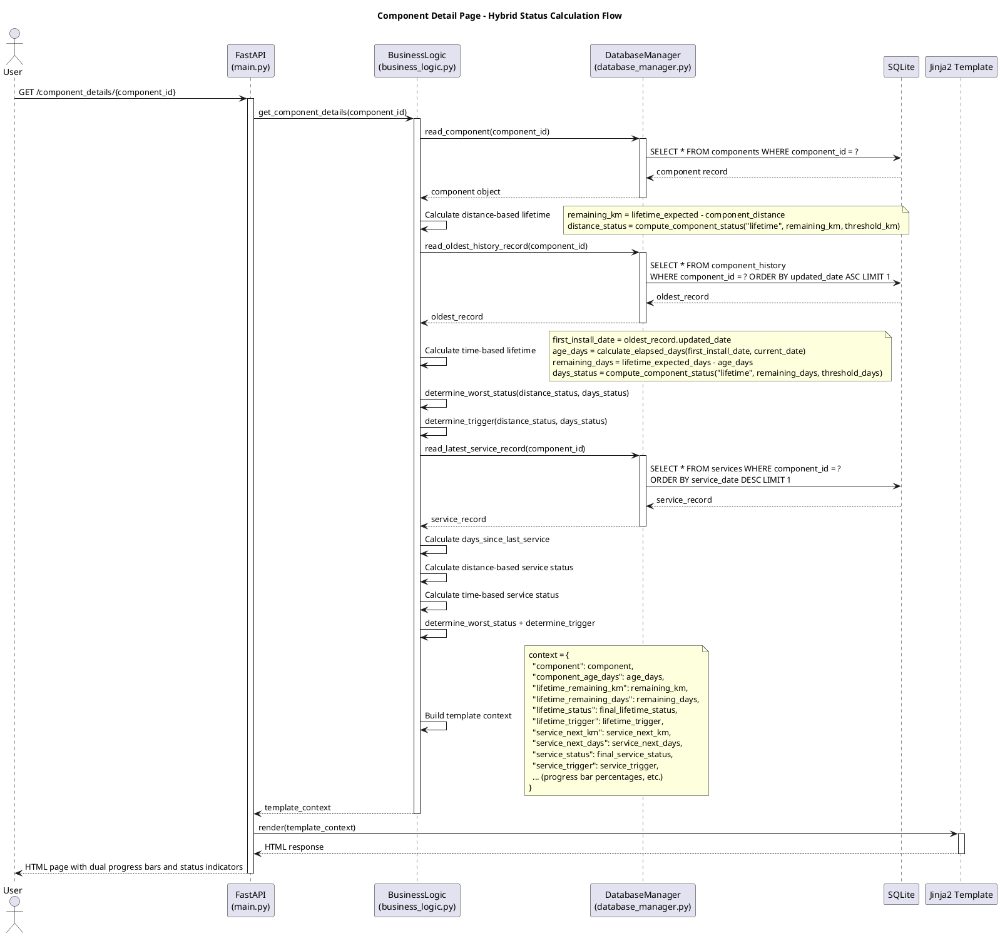
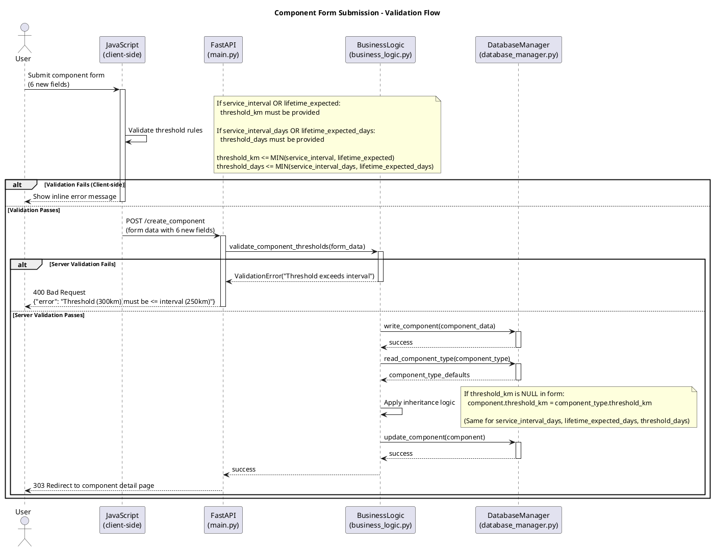

# Architect Handover - Component Status Refinement

**Feature:** Component Status Refinement with Hybrid Time + Distance Tracking
**Date:** 2025-10-26 (Updated: 2025-10-26 - Architectural Refinement v3 with Scheduler)
**Status:** Complete - Ready for UX Designer v2 and Database Expert
**Prepared by:** @architect
**Ready for:** @ux-designer (to create v2) and @database-expert (for migration planning)

**IMPORTANT UPDATE (2025-10-26 - v3):** This handover has been refined three times:
1. **Refinement #1:** Leverage existing `utils.calculate_elapsed_days()` instead of creating wrapper methods (see Decision #9)
2. **Refinement #2:** Leverage existing `database_manager.read_oldest_history_record()` instead of creating `read_first_installation_date()` (see Decision #10)
3. **Refinement #3:** Replace lazy calculation with scheduled batch updates for time-based fields to prevent N+1 query performance issues (see Decision #11)

These refinements follow the DRY principle, reuse existing tested code, and optimize for real-world performance needs.

---

## Context

This architecture handover provides the technical design for transforming Velo Supervisor 2000's distance-only component tracking into a hybrid time + distance system with simplified status thresholds. This design is based on:

1. **Requirements document:** `.handovers/requirements/component-status-refinement-requirements.md`
2. **UX designer handover (v1):** `.handovers/ux/component-status-refinement-ux-designer-handover.md`
3. **Existing codebase analysis:** Reviewed `database_model.py`, `business_logic.py`, `database_manager.py`, `main.py`

### Key Architectural Principles Applied

- **Single-user application:** No complex concurrency patterns, race conditions, or distributed locking needed
- **Layered architecture:** Clear separation between database, business logic, and API routes
- **Code reuse:** Leveraging existing status calculation and component update patterns
- **Scheduled batch updates:** Time-based fields stored in database, updated nightly via APScheduler
- **Server-side rendering:** Jinja2 templates with progressive enhancement

---

## Deliverables

This handover includes:

1. **Database Schema Design** - 6 new fields for Components + 4 for ComponentTypes (includes stored time-based values)
2. **Status Calculation Architecture** - Refactored logic for hybrid time + distance with simplified thresholds
3. **Scheduler Architecture** - APScheduler integration for nightly time-based field updates
4. **API Contract Specifications** - Payload structures, validation rules, error handling
5. **Data Flow Architecture** - Component age calculation, trigger determination, status aggregation
6. **Performance Strategy** - Scheduled batch updates approach avoiding N+1 query issues
7. **Task Breakdown** - Organized by layer (database, backend, scheduler, frontend)
8. **Architectural Constraints for UX** - Technical limitations requiring UX alignment
9. **PlantUML Diagrams** - See Appendix for sequence diagrams

---

## Architecture Overview

### High-Level Design

```
┌─────────────────────────────────────────────────────────────────┐
│                         PRESENTATION LAYER                       │
│  Jinja2 Templates + JavaScript (Bootstrap 5)                    │
│  - Component forms (6 new fields)                               │
│  - Component detail page (dual progress bars)                   │
│  - Component overview table (emoji + trigger indicators)        │
└─────────────────────────────────────────────────────────────────┘
                              ▲
                              │ Template context (DB-stored values)
                              ▼
┌─────────────────────────────────────────────────────────────────┐
│                         API LAYER (main.py)                      │
│  - GET endpoints: return status fields from DB                  │
│  - POST endpoints: validate + write new fields to DB            │
│  - Validation: threshold <= interval checks                     │
│  - Scheduler startup: APScheduler initialization                │
└─────────────────────────────────────────────────────────────────┘
                              ▲
                              │ Business logic methods
                              ▼
┌─────────────────────────────────────────────────────────────────┐
│                    BUSINESS LOGIC LAYER                         │
│  (business_logic.py)                                            │
│                                                                 │
│  REFACTORED METHODS:                                            │
│  - compute_component_status(mode, remaining_value, threshold)   │
│  - update_component_lifetime_status(component)                  │
│  - update_component_service_status(component)                   │
│  - update_bike_status(bike_id)                                  │
│                                                                 │
│  NEW METHODS:                                                   │
│  - determine_trigger(distance_status, days_status)              │
│  - determine_worst_status(distance_status, days_status)         │
│  - update_all_time_based_fields()  # Called by scheduler        │
│                                                                 │
│  REUSED UTILITY FUNCTION:                                       │
│  - utils.calculate_elapsed_days(start_date, end_date)           │
│                                                                 │
└─────────────────────────────────────────────────────────────────┘
                              ▲
                              │ Database queries + writes
                              ▼
┌─────────────────────────────────────────────────────────────────┐
│                    DATABASE LAYER                               │
│  (database_manager.py + database_model.py)                      │
│                                                                 │
│  REUSED EXISTING QUERY METHODS:                                 │
│  - read_oldest_history_record(component_id)                     │
│    Returns oldest ComponentHistory record (always first install)│
│                                                                 │
│  EXTENDED WRITE METHODS:                                        │
│  - write_component_lifetime_status() - now writes days to DB    │
│  - write_component_service_status() - now writes days to DB     │
│                                                                 │
│  NEW FIELDS (ComponentTypes):                                   │
│  - service_interval_days, lifetime_expected_days                │
│  - threshold_km, threshold_days                                 │
│                                                                 │
│  NEW FIELDS (Components):                                       │
│  - service_interval_days, lifetime_expected_days                │
│  - threshold_km, threshold_days                                 │
│  - lifetime_remaining_days, service_next_days  # STORED IN DB   │
│                                                                 │
└─────────────────────────────────────────────────────────────────┘
                              ▲
                              │
                              ▼
┌─────────────────────────────────────────────────────────────────┐
│                      SCHEDULER LAYER (NEW)                      │
│  (scheduler.py + main.py initialization)                        │
│                                                                 │
│  - APScheduler (AsyncIOScheduler)                               │
│  - Nightly job at 3:00 AM                                       │
│  - Updates all active components' time-based fields             │
│  - Non-blocking async execution                                 │
│  - Uses existing business logic methods                         │
│                                                                 │
└─────────────────────────────────────────────────────────────────┘
                              │
                              ▼
                      SQLite Database
```

---

## Database Schema Design

### New Fields - ComponentTypes Table

Add 4 new fields to `ComponentTypes` model in `/home/xivind/code/velo-supervisor-2000/backend/database_model.py`:

**Field Summary:**
- **service_interval_days** (IntegerField, nullable) - CONFIGURATION: Service interval in days (e.g., 365 days)
- **lifetime_expected_days** (IntegerField, nullable) - CONFIGURATION: Expected lifetime in days (e.g., 730 days)
- **threshold_km** (IntegerField, nullable) - CONFIGURATION: Distance threshold for "Due" warnings (e.g., 200 km)
- **threshold_days** (IntegerField, nullable) - CONFIGURATION: Time threshold for "Due" warnings (e.g., 60 days)

**Important:** These are **static configuration values** that define intervals and thresholds - they NEVER reset automatically. They are exactly parallel to existing fields like `service_interval` (km) and `expected_lifetime` (km).

### New Fields - Components Table

Add 6 new fields to `Components` model in `/home/xivind/code/velo-supervisor-2000/backend/database_model.py`:

**Configuration Fields (Static - inherited from ComponentType, user-overridable):**
- **service_interval_days** (IntegerField, nullable) - CONFIGURATION: Service interval in days
- **lifetime_expected_days** (IntegerField, nullable) - CONFIGURATION: Expected lifetime in days
- **threshold_km** (IntegerField, nullable) - CONFIGURATION: Distance threshold for "Due" warnings
- **threshold_days** (IntegerField, nullable) - CONFIGURATION: Time threshold for "Due" warnings

**Calculated/Stored Fields (Dynamic - updated by scheduler and on component changes):**
- **lifetime_remaining_days** (IntegerField, nullable) - CALCULATED: Days remaining in component lifetime (stored in DB, updated nightly)
- **service_next_days** (IntegerField, nullable) - CALCULATED: Days remaining until next service (stored in DB, updated nightly)

**Design Decision: Time-Based Fields STORED in Database**

Time-based remaining fields are **stored in DB** and **updated nightly by scheduler** for:
1. **Performance:** Avoids N+1 query problem (50 components = 100+ queries per page load)
2. **Consistency:** Mirrors existing pattern where `lifetime_remaining` and `service_next` are stored
3. **Adequate freshness:** Daily updates at 3 AM sufficient for day-granularity tracking
4. **Simple implementation:** Reuses existing business logic methods

**Update triggers:**
- Nightly at 3:00 AM via scheduler
- Immediately when component edited, installed, uninstalled or retired, or serviced

### Existing Fields - Modified Behavior

```python
# EXISTING FIELDS with NEW behavior:
lifetime_status = CharField(null=True)    # Now: worst case of (distance-based, time-based)
service_status = CharField(null=True)     # Now: worst case of (distance-based, time-based)
```

**Status calculation changes:**
- **Previously:** Distance percentage thresholds (70%, 90%, 100%)
- **Now:** Absolute remaining value thresholds (remaining < threshold)
- **Hybrid:** Compare time-based and distance-based statuses, use worst case

---

## Status Calculation Architecture

### Refactored: compute_component_status()

**Current location:** `/home/xivind/code/velo-supervisor-2000/backend/business_logic.py:2058-2080`

**NEW signature:**
```python
def compute_component_status(self, mode, remaining_value, threshold_value):
    """
    Compute component status using simplified threshold logic.

    Args:
        mode: "service" or "lifetime"
        remaining_value: Remaining km or days (can be negative if exceeded)
        threshold_value: Threshold km or days for "Due" warning

    Returns: "OK" | "Due for service/replacement" | "Service/Lifetime exceeded" | "Not defined"

    Logic:
        - If threshold is None → "Not defined"
        - If remaining <= 0 → "Exceeded"
        - If 0 < remaining < threshold → "Due"
        - If remaining >= threshold → "OK"
    """
```

**Key changes:** Simple threshold comparison instead of percentage ranges, removed intermediate "approaching" states.

### Reusing Existing Utility: calculate_elapsed_days()

**Location:** `/home/xivind/code/velo-supervisor-2000/backend/utils.py:179-186`

We **reuse the existing utility function** instead of creating wrapper methods (DRY principle):

```python
from utils import calculate_elapsed_days
from datetime import datetime

# Direct usage in status update methods:
oldest_record = database_manager.read_oldest_history_record(component_id)
if oldest_record:
    first_install_date = oldest_record.updated_date
    current_date = datetime.now().strftime("%Y-%m-%d %H:%M")
    success, age_days = calculate_elapsed_days(first_install_date, current_date)
```

### New Method: determine_trigger()

```python
def determine_trigger(self, distance_status, days_status):
    """
    Determine which factor(s) triggered a warning status.

    Returns: 'distance' | 'time' | 'both' | None

    Logic:
        - If BOTH are warning statuses → 'both'
        - If ONLY distance is warning → 'distance'
        - If ONLY days is warning → 'time'
        - Otherwise → None
    """
```

### New Method: determine_worst_status()

```python
def determine_worst_status(self, distance_status, days_status):
    """
    Determine worst-case status between distance and days-based calculations.

    Severity ranking (worst to best):
        1. "Exceeded" statuses
        2. "Due" statuses
        3. "OK"
        4. "Not defined"

    Returns: Worst case status string
    """
```

### Refactored: update_component_lifetime_status()

**Current location:** `/home/xivind/code/velo-supervisor-2000/backend/business_logic.py:777-804`

**Key changes:**
- Calculates **both** distance-based and time-based statuses independently
- Uses **refactored `compute_component_status()`** with simplified threshold logic
- Uses **existing `utils.calculate_elapsed_days()`** for time calculations
- Calls **new helper methods** for worst-case status and trigger determination
- Handles retired components by freezing time at retirement date
- Writes **both** `remaining_days` and status to database

**Similar pattern for:** `update_component_service_status()` (lines 806-942)

### Refactored: update_bike_status()

**Current location:** `/home/xivind/code/velo-supervisor-2000/backend/business_logic.py:988-1044`

**Key changes:**
- Removed `"maintenance_approaching"` counter (4-level system now 3 counters)
- Updated status checks to match new status strings
- Simplified aggregation logic

---

## Database Layer Updates

### Reused Existing Query Method: read_oldest_history_record()

**Location:** `/home/xivind/code/velo-supervisor-2000/backend/database_manager.py:207-212`

We do NOT create a new method - the existing `read_oldest_history_record()` already provides what we need:

**Why this works:**
- ComponentHistory records are ONLY created when components are installed (business_logic.py:1083-1084)
- Components created as "Not installed" get NO history record (business_logic.py:1090-1091)
- Therefore, oldest record is ALWAYS first installation - no filtering needed

**Performance:** Efficient single SELECT with indexed `component_id` field.

### Extended Write Methods

**write_component_lifetime_status()** - Now accepts `lifetime_remaining_days` parameter, writes to DB
**write_component_service_status()** - Now accepts `service_next_days` parameter, writes to DB

Note: `lifetime_trigger` and `service_trigger` are NOT stored - they can be recalculated on-demand.

---

## Scheduler Architecture for Time-Based Field Updates

### Overview

Nightly scheduler using **APScheduler** updates all active components' time-based fields at 3:00 AM to prevent N+1 query performance issues.

### APScheduler Integration

**New file:** `/home/xivind/code/velo-supervisor-2000/backend/scheduler.py`

**Key components:**
- `start_scheduler()` - Initialize APScheduler with AsyncIOScheduler
- `stop_scheduler()` - Graceful shutdown
- `update_time_based_fields_job()` - Async job function called at 3:00 AM
- CronTrigger configuration for daily execution

**Design note:** The scheduler is designed as a generic system maintenance framework that can run multiple scheduled jobs. For this feature, we're adding the first job (updating time-based fields), but the architecture supports adding other maintenance tasks in the future (e.g., cleanup, backups, notifications).

### Business Logic Method: update_all_time_based_fields()

**Add to:** `/home/xivind/code/velo-supervisor-2000/backend/business_logic.py`

**Functionality:**
- Get all active components (installation_status != "Retired")
- For each component with time-based intervals configured:
  - Update lifetime status (includes time calculation)
  - Update service status (includes time calculation)
  - Update bike status if component is installed
- Returns: (success, "Updated N components, M errors")

### Main.py Integration

**Modify:** `/home/xivind/code/velo-supervisor-2000/backend/main.py`

```python
from scheduler import start_scheduler, stop_scheduler
import atexit

@app.on_event("startup")
async def startup_event():
    start_scheduler()

@app.on_event("shutdown")
async def shutdown_event():
    stop_scheduler()

atexit.register(lambda: stop_scheduler() if stop_scheduler else None)
```

### Error Handling

- **Job-level errors:** Catch all exceptions, log error, don't crash scheduler
- **Component-level errors:** Skip failed component, log error, continue
- **Startup errors:** Log and raise (prevent app startup if scheduler fails)

### Docker Considerations

- No DOCKERFILE changes needed (APScheduler runs in-process)
- Add `APScheduler` to `requirements.txt`
- Scheduler uses system timezone (UTC in Docker by default)
- Set `TZ` environment variable for different timezone if needed

### Performance Characteristics

- Minimal memory footprint (in-process AsyncIOScheduler)
- Non-blocking async execution (doesn't block FastAPI)
- Execution time: ~1 second for 50 components, ~10 seconds for 500 components
- Runs at 3:00 AM (low user activity)

---

## Data Flow Architecture

See **Appendix - Diagrams** for:
- **Diagram A1:** Component Detail Page - Hybrid Status Calculation Flow
- **Diagram A2:** Component Form Submission - Validation Flow

---

## API Contract Specifications

### POST /create_component (Enhanced)

**Current endpoint:** `/home/xivind/code/velo-supervisor-2000/backend/main.py`

**NEW Form parameters:**
- `lifetime_expected_days` (Optional[str]) - Configuration value (days)
- `service_interval_days` (Optional[str]) - Configuration value (days)
- `threshold_km` (Optional[str]) - Configuration value (km threshold)
- `threshold_days` (Optional[str]) - Configuration value (days threshold)

**NEW VALIDATION RULES:**
- If `expected_lifetime` OR `service_interval` provided → `threshold_km` REQUIRED
- If `lifetime_expected_days` OR `service_interval_days` provided → `threshold_days` REQUIRED
- `threshold_km` must be <= MIN(service_interval, expected_lifetime) if both configured
- `threshold_days` must be <= MIN(service_interval_days, lifetime_expected_days) if both configured
- All integer fields must be > 0 if provided

**Validation implementation:**
- Frontend JS validates and prevents form submission if validation fails
- Backend validation in `business_logic.create_component()` / `update_component_details()` as failsafe
- Returns existing tuple pattern: `(success: bool, message: str, component_id: str)`
- Errors displayed via existing toast pattern (redirect with `?success=false&message=...`)

### POST /edit_component (Enhanced)

Same signature and validation as `/create_component`.

### GET /component_details/{component_id} (Enhanced)

**NEW CONTEXT FIELDS:**
- `component_age_days` - Component age in days (int or None)
- `lifetime_remaining_days` - Read from DB (int or None)
- `service_next_days` - Read from DB (int or None)
- `lifetime_status_distance` - Distance-based status only
- `lifetime_status_days` - Time-based status only (days)
- `service_status_distance` - Distance-based status only
- `service_status_days` - Time-based status only (days)
- `lifetime_trigger` - 'distance', 'time', 'both', or None (calculated on-demand)
- `service_trigger` - 'distance', 'time', 'both', or None (calculated on-demand)
- `lifetime_percentage_km` - For progress bar
- `lifetime_percentage_days` - For progress bar
- `service_percentage_km` - For progress bar
- `service_percentage_days` - For progress bar

### GET /component_overview (Enhanced)

Each component now includes:
- `lifetime_trigger` - Calculated on-demand for table display
- `service_trigger` - Calculated on-demand for table display

### POST /quick_swap (Enhanced)

**NEW Form parameters (when creating new component during swap):**
- `new_service_interval_days` (Optional[str]) - Service interval in days
- `new_lifetime_expected_days` (Optional[str]) - Expected lifetime in days
- `new_threshold_km` (Optional[str]) - Distance threshold
- `new_threshold_days` (Optional[str]) - Time threshold

**Validation:**
- Same validation rules as `/create_component` apply when creating new component
- new_component_data dictionary extended with 4 new fields
- Validation performed in business logic before component creation

---

## Validation Architecture

### Client-Side Validation (JavaScript)

**Add to component form JavaScript:**

```javascript
function validateComponentThresholds() {
    // Extract form values
    // Rule 1: threshold_km required when distance intervals exist
    // Rule 2: threshold_days required when time intervals exist
    // Rule 3: threshold_km <= smallest interval
    // Rule 4: threshold_days <= smallest interval
    // Display errors if validation fails
    return true/false;
}
```

### Server-Side Validation (Python)

**Add validation to existing `create_component()` and `update_component_details()` methods in business_logic.py:**

- Implements same validation rules as client-side (failsafe)
- Returns existing tuple pattern: `(success: bool, message: str, component_id: str)`
- Validation runs before database writes

---

## Performance Strategy

### Scheduled Batch Updates Approach

**Decision:** Store time-based remaining values in database, update nightly via scheduler.

**Performance Comparison:**

| Approach | Overview Page (50 components) | Detail Page | Freshness | Complexity |
|----------|-------------------------------|-------------|-----------|------------|
| Lazy calculation | ~100 queries | ~2 queries | Real-time | Low |
| **Scheduled batch** (chosen) | 0 extra queries | 0 extra queries | Daily 3 AM | Medium |

**When stored values are updated:**
1. Nightly at 3:00 AM (scheduler job)
2. On component edit
3. On install/uninstall
4. On service

**Future optimizations (if needed):**
- Batch size limiting (process 100 at a time)
- Differential updates (only components with time-based intervals)
- Manual trigger endpoint for admin

---

## Retired Component Handling

### Design Decision: Freeze Time Calculations at Retirement

**Implementation:**
```python
# In update_component_lifetime_status():
if component.installation_status == "Retired":
    end_date = component.updated_date  # Use retirement date - FROZEN
else:
    end_date = datetime.now().strftime("%Y-%m-%d %H:%M")  # Use current date - CONTINUES
```

**Time calculation behavior by status:**
- **"Retired"**: Time calculations FROZEN at retirement date (component no longer aging)
- **"Installed"**: Time calculations CONTINUE using current date (component continues aging)
- **"Not installed"**: Time calculations CONTINUE using current date (component continues aging even when not installed)

**Rationale:** Only retired components stop deteriorating - all other statuses continue aging from first installation date.

**UI Indicator (for UX designer):**
```html
<div class="alert alert-secondary" role="alert">
    ⛔ This component was retired on {{ retirement_date }}.
    Time-based values are frozen as of retirement date.
</div>
```

---

## Task Breakdown

### Database Layer Tasks (for @database-expert)

1. **Add fields to ComponentTypes** (4 fields)
2. **Add fields to Components** (6 fields: 4 config + 2 calculated/stored)
3. **Create migration script** with:
   - NULL defaults for all new fields
   - Populate `threshold_km` = 200 for existing components with distance intervals
   - Leave `threshold_days`, `lifetime_remaining_days`, `service_next_days` as NULL
4. **No new query methods needed** - reuse existing `read_oldest_history_record()` and `read_latest_service_record()`

### Backend Layer Tasks (for @fullstack-developer)

1. **Create scheduler.py** - NEW FILE with APScheduler integration
2. **Refactor status calculation** - `compute_component_status()`, add `determine_trigger()`, `determine_worst_status()`
3. **Add scheduler job method** - `update_all_time_based_fields()` in business_logic.py
4. **Refactor status update methods** - `update_component_lifetime_status()`, `update_component_service_status()`, `update_bike_status()`
5. **Extend component creation/edit** - Handle 6 new fields, field inheritance, add validation logic to existing methods
6. **Update database write methods** - Extend to write `lifetime_remaining_days`, `service_next_days`
7. **Update API endpoints** - Scheduler initialization, new Form parameters, validation, read stored values
   - `/create_component` - Add 4 new Form parameters (time-based intervals and thresholds)
   - `/update_component_details` - Add same 4 Form parameters
   - `/quick_swap` - Add 4 new Form parameters for creating new component during swap
8. **Update template context methods** - Read stored values from DB, calculate triggers
9. **Update dependencies** - Add `APScheduler` to requirements.txt

### Frontend Layer Tasks (for @fullstack-developer)

**Pages:**
1. **component_details.html** - Dual progress bars (km + days), component age display, trigger indicators
2. **component_overview.html** - Add trigger indicators to component table, update statistics
3. **bike_details.html** - Update component tables with new trigger indicators
4. **component_types.html** - ComponentType management page (if changes needed for display)

**Modals (containing forms):**
5. **modal_create_component.html** - Add 6 new form fields with tooltips, client-side validation
6. **modal_update_component_details.html** - Add same 6 fields with "Inherited" badge logic
7. **modal_component_type.html** - Add 4 new default fields (days intervals and thresholds)
8. **modal_quick_swap.html** - Add 4 new fields to "Create new component" section (service_interval_days, lifetime_expected_days, threshold_km, threshold_days)

**JavaScript:**
9. **main.js** - Add `validateComponentThresholds()` function for client-side validation (apply to all component forms including quick swap)

### Testing Tasks (for @code-reviewer)

1. Test validation logic (client-side and server-side)
2. Test status calculations (distance-only, time-only, hybrid, worst-case, triggers)
3. Test UI rendering (dual progress bars, triggers, responsive layouts)
4. Test database migration (on copy of production DB)
5. Test scheduler execution and error handling

---

## Architectural Constraints for UX Designer

**The following technical constraints require @ux-designer to update their v2 specifications:**

### 1. Time-Based Fields Stored in Database, Updated by Scheduler

**Constraint:** `lifetime_remaining_days` and `service_next_days` stored in DB, updated nightly at 3:00 AM.

**Impact on UX:** ✅ NO IMPACT - Values available in template context, displayed as designed. May be up to 24 hours stale (acceptable for day-granularity).

### 2. Trigger Indicators NOT Stored in Database

**Constraint:** Calculated on-demand when rendering pages.

**Impact on UX:** ✅ NO IMPACT - Values still available in template context.

### 3. Field Inheritance Implementation

**Constraint:** Implemented via value comparison in Jinja2 template, not database flag.

**Impact on UX:** ✅ NO CHANGES NEEDED - "Inherited" badge logic as designed will work.

### 4. Validation Error Display

**Constraint:** Server-side validation uses existing toast pattern (redirect with query parameters).

**Impact on UX:** ✅ DECISION MADE - Use existing pattern: backend returns `(success, message, component_id)` tuple, API redirects with `?success=false&message=...`, frontend displays toast notification via existing DOMContentLoaded handler.

### 5. Progress Bar Capping

**Constraint:** Backend can return negative remaining values when exceeded.

**Impact on UX:** ✅ DECISION MADE - Backend returns uncapped percentage (can exceed 100% or go negative). Template caps display at 100% for progress bars. This keeps raw data accurate while preventing broken UI display.

### 6. Scheduler Performance Characteristics

**Constraint:** Runs at 3:00 AM system time (UTC in Docker).

**Impact on UX:** ✅ NO IMPACT - Job runs during low-activity window.

### 7. Retired Component Time Freeze

**Constraint:** Time calculations freeze at retirement `updated_date`.

**Impact on UX:** ✅ DECISION MADE - Display alert box on component_details page for retired components: "⛔ This component was retired on [date]. Time-based values are frozen as of retirement date." (Bootstrap alert-secondary class, consistent emoji usage)

### 8. Null Handling in Templates

**Constraint:** All new fields nullable.

**Impact on UX:** ✅ CONFIRMED - UX v1 design shows "Not configured" or "-" for NULL values.

---

## Decisions Made

### 1. Use Scheduled Batch Updates (NOT Lazy Calculation)

**Decision:** Store time-based remaining values in DB, update nightly via APScheduler.

**Rationale:**
- Prevents N+1 query problem (50 components = 100+ queries per page with lazy approach)
- Consistent with existing pattern (distance fields already stored)
- Adequate freshness (daily updates at 3 AM sufficient)
- Simple implementation (reuses existing business logic)

**Alternative Rejected:** Lazy calculation - causes performance issues reported by user.

### 2. Reuse Existing calculate_elapsed_days() Utility

**Decision:** Use `utils.calculate_elapsed_days()` directly instead of creating wrapper methods.

**Rationale:**
- DRY principle - avoids duplicating tested logic
- Simpler implementation - fewer methods to maintain
- Consistent error handling pattern

**Alternative Rejected:** Create `calculate_component_age_days()` wrapper - unnecessary abstraction.

### 3. Reuse Existing read_oldest_history_record()

**Decision:** Use existing method instead of creating `read_first_installation_date()`.

**Rationale:**
- Oldest record IS first installation (ComponentHistory only created on install)
- No filtering needed - already provides exact data we need
- Avoids code duplication

**Alternative Rejected:** New filtered method - redundant functionality.

### 4. Refactored compute_component_status() with Threshold Logic

**Decision:** Use `remaining < threshold` instead of percentage ranges.

**Rationale:**
- Meets requirements for simplified thresholds
- Eliminates intermediate "approaching" states
- Clearer decision points for users

**Alternative Rejected:** Keep percentage logic - doesn't address requirements pain points.

### 5. Freeze Time Calculations for Retired Components Only

**Decision:** ONLY "Retired" components use retirement date. "Installed" and "Not installed" components use current date.

**Rationale:**
- Retired components no longer deteriorating - frozen at retirement
- Installed and Not installed components continue aging
- Components age from first installation regardless of current installation status
- Prevents false "exceeded" warnings for retired components

**Alternative Rejected:** Freeze all non-installed components - incorrect, as stored components still age.

### 6. Client-Side + Server-Side Validation

**Decision:** Implement both.

**Rationale:**
- Client-side: Immediate feedback, better UX
- Server-side: Security, data integrity
- Industry best practice

**Alternative Rejected:** Server-side only - poor UX.

### 7. Field Inheritance via Value Comparison

**Decision:** Compare values in Jinja2, don't store inheritance flags.

**Rationale:**
- No additional DB fields
- Simple comparison logic
- Aligns with UX v1 design

**Alternative Rejected:** Database flags - redundant storage.

### 8. Trigger Indicators Calculated On-the-Fly

**Decision:** Calculate when rendering, don't store.

**Rationale:**
- Simple calculation (compare two strings)
- Always accurate
- No DB overhead

**Alternative Rejected:** Store in DB - redundant.

### 9. Separate Threshold Fields (threshold_km and threshold_days)

**Decision:** Use separate fields, both nullable.

**Rationale:**
- Different units require separate thresholds
- Flexibility for pure time or distance components
- Clear UI

**Alternative Rejected:** Single percentage threshold - requirements specify absolute values.

---

## Risks and Mitigations

### Risk 1: Migration Data Loss

**Likelihood:** Low | **Impact:** Critical

**Mitigation:**
- ALWAYS backup database before migration (`backup_db.sh`)
- Test on copy of production DB first
- Document rollback procedure
- Idempotent migration script

### Risk 2: Validation Bypass

**Likelihood:** Medium | **Impact:** Low

**Mitigation:**
- Server-side validation prevents invalid data
- Return error message according to established patterns
- Log validation failures

### Risk 3: Retired Component Logic Issues

**Likelihood:** Low | **Impact:** Low

**Mitigation:**
- Clear UI indicator for retired components
- Thorough testing
- Document behavior

### Risk 4: UX v2 Incompatible with Architecture

**Likelihood:** Low | **Impact:** Medium

**Mitigation:**
- Architectural constraints clearly documented
- @ux-designer reads this before creating v2
- Communication between agents

### Risk 5: Scheduler Failure

**Likelihood:** Low | **Impact:** Medium

**Mitigation:**
- Comprehensive error handling
- Component-level error isolation
- Non-critical failure (app continues if scheduler fails)
- Logging for monitoring

---

## Integration Points

### Files to Modify

1. **`/home/xivind/code/velo-supervisor-2000/backend/database_model.py`**
   - Add 4 fields to ComponentTypes (lines ~51-62)
   - Add 6 fields to Components (lines ~65-86)

2. **`/home/xivind/code/velo-supervisor-2000/backend/database_manager.py`**
   - ✅ NO NEW QUERY METHODS - reuse existing
   - Extend `write_component_lifetime_status()` to write `lifetime_remaining_days`
   - Extend `write_component_service_status()` to write `service_next_days`

3. **`/home/xivind/code/velo-supervisor-2000/backend/scheduler.py`** - NEW FILE
   - Implement scheduler with APScheduler

4. **`/home/xivind/code/velo-supervisor-2000/backend/business_logic.py`**
   - Refactor `compute_component_status()` (lines 2058-2080)
   - Add new methods: `determine_trigger()`, `determine_worst_status()`, `update_all_time_based_fields()`
   - Import: `from utils import calculate_elapsed_days`
   - Refactor: `update_component_lifetime_status()` (lines 777-804), `update_component_service_status()` (lines 806-942), `update_bike_status()` (lines 988-1044)
   - Extend: `create_component()` (lines 1046-1076), `get_component_details()`, `get_component_overview()`

5. **`/home/xivind/code/velo-supervisor-2000/backend/main.py`**
   - Import scheduler functions
   - Add startup/shutdown event handlers
   - Extend POST endpoints for new fields: `/create_component`, `/update_component_details`, `/quick_swap`
   - Update GET endpoints to read stored values

6. **`/home/xivind/code/velo-supervisor-2000/backend/db_migration.py`**
   - Add migration for 10 new fields

7. **`/home/xivind/code/velo-supervisor-2000/requirements.txt`**
   - Add `APScheduler`

8. **Frontend:**
   - Pages: `component_details.html`, `component_overview.html`, `bike_details.html`, `component_types.html`
   - Modals: `modal_create_component.html`, `modal_update_component_details.html`, `modal_component_type.html`, `modal_quick_swap.html`
   - JavaScript: `frontend/static/js/main.js`

### External Dependencies

**New dependency:** APScheduler (Python library for scheduling)

---

## Next Steps

### For @ux-designer (v2 Update)

1. Read this architecture handover, especially "Architectural Constraints" section
2. Address architectural constraints (validation error display, retired component indicator, progress bar capping)
3. Update UX handover to v2 in `.handovers/ux/component-status-refinement-ux-designer-handover.md`
4. Handoff to @database-expert for migration planning

### For @database-expert

1. Read requirements, UX v1, UX v2 (when ready), and this architecture handover
2. Design migration script for 10 new fields (4 ComponentTypes, 6 Components)
3. Test migration on copy of production database
4. Create database handover in `.handovers/database/component-status-refinement-database-handover.md`
5. Handoff to @fullstack-developer

---

## References

**Requirements:** `.handovers/requirements/component-status-refinement-requirements.md`
**UX v1:** `.handovers/ux/component-status-refinement-ux-designer-handover.md`
**Existing code:**
- `/home/xivind/code/velo-supervisor-2000/backend/database_model.py`
- `/home/xivind/code/velo-supervisor-2000/backend/business_logic.py:777-804, 806-942, 988-1044, 2058-2080`
- `/home/xivind/code/velo-supervisor-2000/backend/database_manager.py:207-212`
- `/home/xivind/code/velo-supervisor-2000/backend/utils.py:179-186`
- `/home/xivind/code/velo-supervisor-2000/backend/main.py`

---

## Handover Checklist

**For all agents:**
- [x] All sections filled with specific information
- [x] File paths include line numbers
- [x] Status accurate (Complete - Ready for UX v2 and Database Expert)
- [x] Next agents identified (@ux-designer and @database-expert)
- [x] All ambiguities resolved
- [x] All blockers addressed
- [x] References include specific file paths

**@architect:**
- [x] Technical decisions include rationale (9 major decisions)
- [x] Integration points identified (8 files + 1 new file)
- [x] Performance considerations documented (scheduled batch strategy)
- [x] Breaking changes highlighted (N/A - backward compatible)
- [x] PlantUML diagrams included (2 diagrams in Appendix)
- [x] Database schema fully specified
- [x] Scheduler architecture fully specified
- [x] API contracts provided
- [x] Task breakdown by layer
- [x] Architectural constraints documented (8 constraints)
- [x] Risks and mitigations documented (5 risks)
- [x] Code reuse emphasized (3 refinements)

---

**Handover Created:** `.handovers/architecture/component-status-refinement-architect-handover.md`

**Next Agents:**
- **@ux-designer** - Read architectural constraints, update UX handover to v2
- **@database-expert** - Design migration script after UX v2 complete

**Action Required:**
- @ux-designer: Update UX specifications (v2) to address 8 architectural constraints
- @database-expert: Create migration plan for 10 new database fields

---

# Appendix - Diagrams

## Diagram A1: Component Detail Page - Hybrid Status Calculation Flow



## Diagram A2: Component Form Submission - Validation Flow


