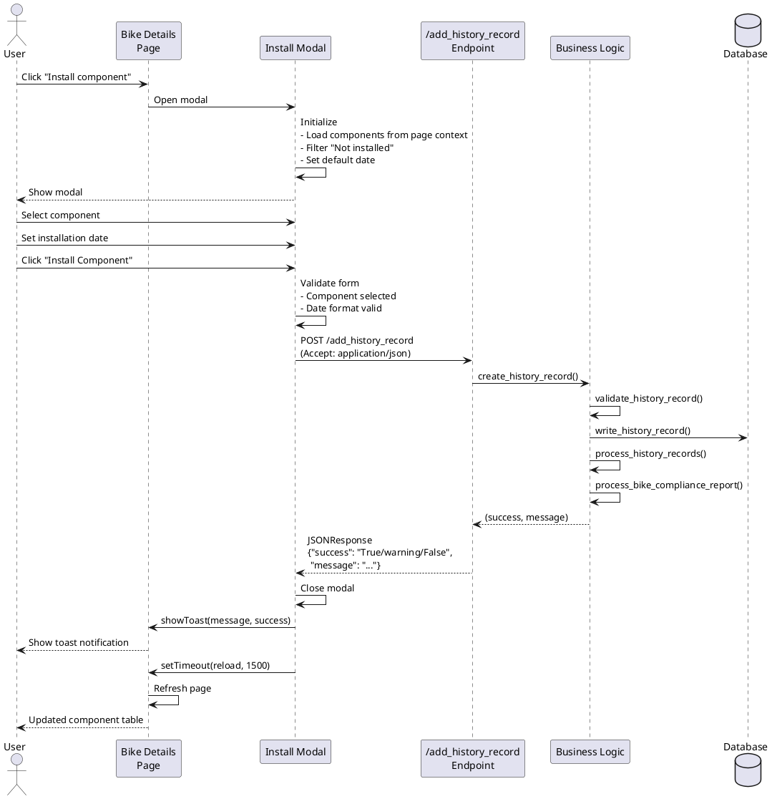
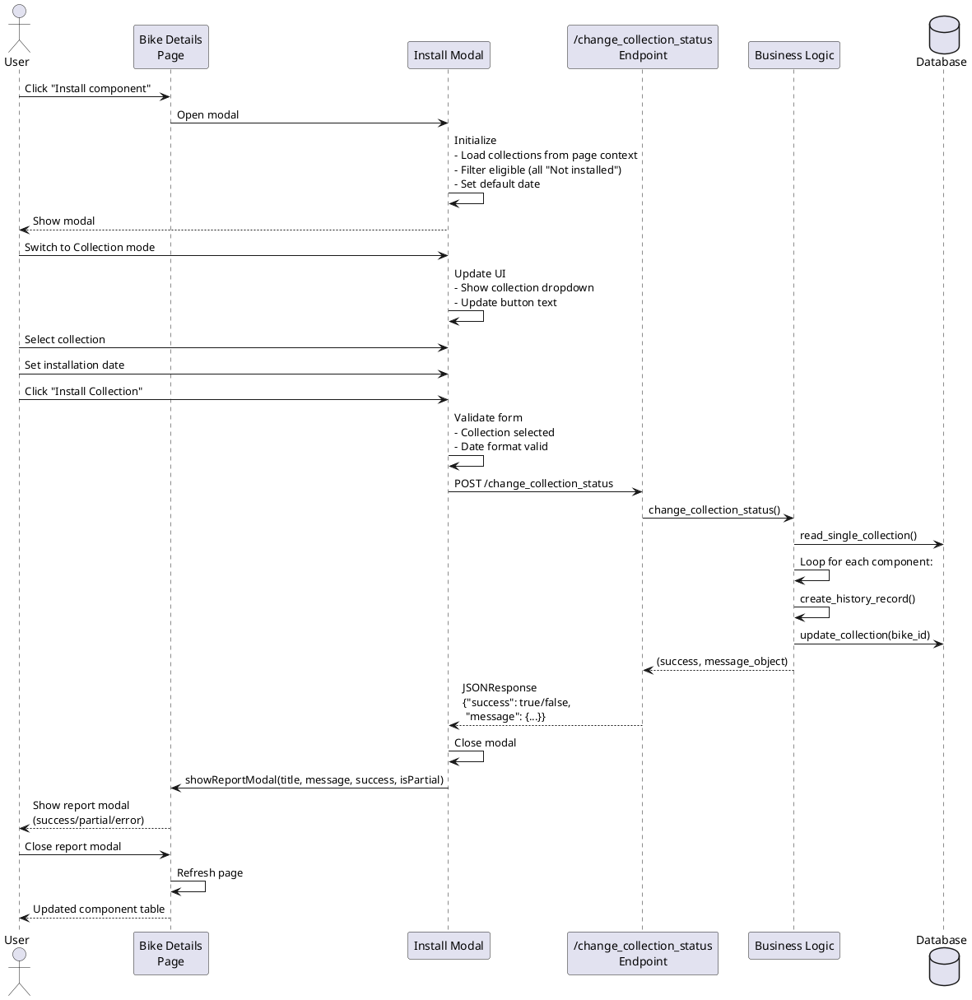
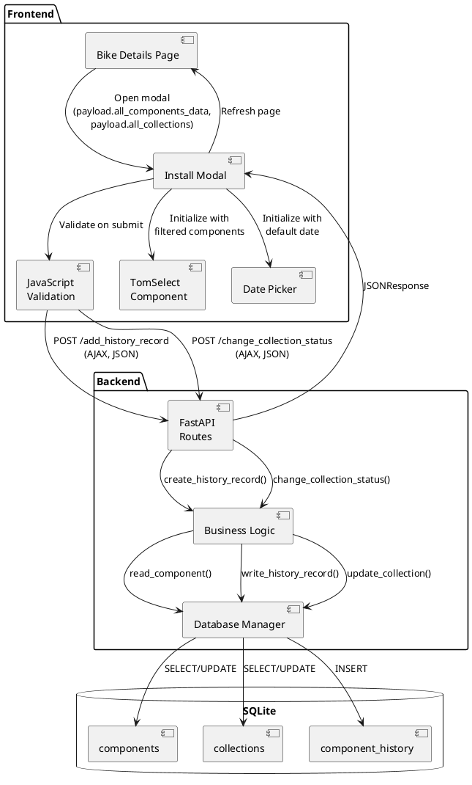
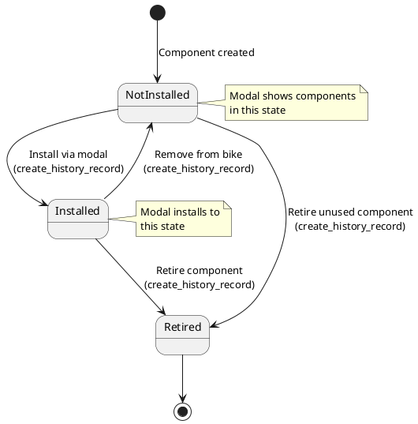

# Architect → UX Designer (v2) Handover - Install Unassigned Components

**Feature/Task:** Install Unassigned Components/Collections from Bike Details Page
**Date:** 2025-12-13
**Status:** Architecture Complete - Ready for UX Designer v2
**Prepared by:** @architect
**Ready for:** @ux-designer (for v2 update), then @fullstack-developer

---

## Context

This architecture document defines the technical design for installing unassigned components or collections directly from the bike details page. The feature maximizes code reuse by leveraging existing endpoints (`/add_history_record` for components, `/change_collection_status` for collections) with minimal backend modifications.

**Key Architectural Decision:** This is primarily a **frontend orchestration feature** requiring only ONE small backend modification (making `/add_history_record` return JSON for AJAX calls). All business logic, validation, and data structures already exist.

**Input Documents:**
- Requirements: `.handovers/requirements/install-unassigned-components-requirements.md`
- UX Specifications (v1): `.handovers/ux/install-unassigned-components-ux-designer-handover.md`

---

## Architecture Overview

### Design Principles

1. **Maximize Code Reuse:** Leverage existing endpoints, business logic, validation, and JavaScript utilities
2. **Minimal Backend Changes:** Only modify `/add_history_record` to support JSON responses for AJAX
3. **Consistent UX Patterns:** Reuse toast notifications (components) and report modals (collections)
4. **Data from Page Context:** Component and collection data embedded in Jinja2 template (no new API endpoints needed)
5. **Single-User Simplicity:** No over-engineering for concurrency or race conditions

### High-Level Data Flow

```
User clicks "Install Component" button
  ↓
Modal opens with Component mode (default)
  ↓
Component/Collection data already in page context (from payload.all_components_data)
  ↓
User selects component/collection and installation date
  ↓
Frontend validates (required fields, date format)
  ↓
AJAX POST to existing endpoint (/add_history_record OR /change_collection_status)
  ↓
Backend validates and processes (existing business logic)
  ↓
JSON response returned to frontend
  ↓
Success: Modal closes → Toast/Report modal → Page refresh
Error: Modal closes → Toast/Report modal → User can retry
```

---

## Code Reuse Analysis

### Existing Backend Methods to Leverage

**Components Installation:**
- **Endpoint:** `POST /add_history_record` (`/home/xivind/code/velo-supervisor-2000/backend/main.py:260-276`)
  - **Current behavior:** Returns `RedirectResponse`
  - **Required change:** Add JSON response support for AJAX requests
  - **Business logic:** `business_logic.create_history_record()` (line 1340) - REUSED AS-IS
  - **Validation:** All validation already exists in `create_history_record()` - NO NEW VALIDATION NEEDED

**Collections Installation:**
- **Endpoint:** `POST /change_collection_status` (`/home/xivind/code/velo-supervisor-2000/backend/main.py:377-389`)
  - **Current behavior:** Already returns `JSONResponse` - PERFECT FOR REUSE
  - **Business logic:** `business_logic.change_collection_status()` (line 1885) - REUSED AS-IS
  - **Validation:** All validation already exists - NO NEW VALIDATION NEEDED

**Data Retrieval:**
- **Components list:** `payload.all_components_data` already available in bike_details template
  - Generated by `business_logic.get_bike_details()` (line 105)
  - Contains all components with full details - REUSED AS-IS
- **Collections list:** Can be added to bike_details payload using existing `business_logic.get_all_collections()` (line 481)
  - Already used in component_overview page - REUSED AS-IS

### Existing Frontend Utilities to Leverage

**JavaScript Functions (from `/home/xivind/code/velo-supervisor-2000/frontend/static/js/main.js`):**
- `showToast()` (line 272) - Component installation feedback - REUSED AS-IS
- `showReportModal()` (line 57) - Collection installation feedback - REUSED AS-IS
- Date validation pattern (lines 98-106) - Form validation - REUSED AS-IS
- TomSelect initialization patterns (line 1177+) - Component search - REUSED AS-IS

**Template Patterns:**
- Modal structure: `modal_quick_swap.html` - Similar bike context alert pattern
- Date picker: `modal_create_component.html` - Tempus Dominus configuration
- Component selection: `modal_quick_swap.html` - TomSelect with filtering (lines 16-30)

### New Code Required

**Backend (MINIMAL):**
- Modify `/add_history_record` endpoint to detect AJAX requests and return JSON (5-10 lines)
- Add `all_collections` to bike_details payload (1 line in `get_bike_details()`)

**Frontend (NEW):**
- Create `modal_install_component.html` (new template, ~200 lines)
- Add JavaScript for modal behavior, validation, AJAX submission (~150 lines)
- Add button to bike_details.html (3 lines)
- Include modal in bike_details.html (4 lines)

**Total New Code:** ~360 lines (vs. ~1000+ if not reusing existing infrastructure)

---

## Answers to UX Designer's 5 Backend Questions

### Q1: Data Retrieval Method

**Decision: Option B - Include data in page context (page load)**

**Rationale:**
- `payload.all_components_data` already exists in bike_details template
- Simply add `payload.all_collections` to bike_details payload
- No network latency when opening modal
- Consistent with Quick Swap modal pattern
- Minimal backend change (1 line)

**Implementation:**
```python
# In business_logic.py, get_bike_details() method (around line 105)
all_components_data = database_manager.read_all_components()
all_collections = self.get_all_collections()  # ADD THIS LINE

# In return payload (around line 195)
payload = {
    "all_components_data": all_components_data,
    "all_collections": all_collections,  # ADD THIS LINE
    # ... rest of payload
}
```

**Frontend filtering:**
- Filter `all_components_data` for `installation_status == "Not installed"` (client-side)
- Filter `all_collections` for collections where ALL components are "Not installed" (client-side)

---

### Q2: AJAX vs Form Submission - Endpoint Modification Needed

**Decision: Modify `/add_history_record` to support AJAX with JSON response**

**Current Behavior:**
```python
# main.py line 272-274
response = RedirectResponse(
    url=f"/component_details/{component_id}?success={success}&message={message}",
    status_code=303)
```

**Required Modification:**
```python
# Detect AJAX request via Accept header
@app.post("/add_history_record")
async def add_history_record(request: Request,
                             component_id: str = Form(...),
                             component_installation_status: str = Form(...),
                             component_bike_id: str = Form(...),
                             component_updated_date: str = Form(...)):
    """Endpoint to add component history record"""

    success, message = business_logic.create_history_record(
        component_id,
        component_installation_status,
        component_bike_id,
        component_updated_date)

    # Check if this is an AJAX request
    accept_header = request.headers.get('Accept', '')
    if 'application/json' in accept_header:
        # Return JSON for AJAX requests
        return JSONResponse({
            "success": success,
            "message": message
        })
    else:
        # Return redirect for traditional form submissions (preserve existing behavior)
        response = RedirectResponse(
            url=f"/component_details/{component_id}?success={success}&message={message}",
            status_code=303)
        return response
```

**Why This Works:**
- Preserves existing form submission behavior (backward compatible)
- Enables AJAX calls by detecting `Accept: application/json` header
- No breaking changes to existing component_details page
- Single endpoint serves both use cases

**Collection Endpoint:**
- `/change_collection_status` already returns JSONResponse - NO CHANGE NEEDED

---

### Q3: Response Format

**Component Installation Response (from modified `/add_history_record`):**
```json
{
  "success": "True" | "warning" | "False",
  "message": "Component installed successfully" | "Warning message" | "Error message"
}
```

**Success values:**
- `"True"` - Component installed successfully
- `"warning"` - Component installed but compliance warning (e.g., max quantity exceeded)
- `"False"` - Installation failed (validation error, component already installed, etc.)

**Collection Installation Response (existing `/change_collection_status`):**
```json
{
  "success": true | false,
  "message": {
    "type": "success" | "partial_failure" | "error",
    "summary": "X components updated successfully",
    "successful_components": ["Component A", "Component B"],
    "failed_components": [
      {"name": "Component C", "error": "Reason"}
    ]
  }
}
```

**Frontend Handling:**
- Component: `showToast(message, success)` - Maps directly to existing toast function
- Collection: `showReportModal(title, formattedMessage, success, isPartial)` - Existing pattern from line 2063

---

### Q4: Component Type Compliance - When/How Validation Occurs

**Decision: Server-side validation ONLY (after submission)**

**Rationale:**
- Compliance validation logic already exists in `create_history_record()` (line 1380-1383)
- Pre-validation would require duplicating complex business logic in JavaScript
- Non-blocking warnings (component still installs) - no UX benefit to early warning
- Keep frontend simple, let backend handle all business rules

**Implementation Flow:**
```
User submits form
  ↓
Frontend validation (required fields, date format)
  ↓
AJAX POST to /add_history_record
  ↓
Backend validates component exists, bike exists, status is "Not installed"
  ↓
Backend creates history record
  ↓
Backend checks bike compliance (existing logic in create_history_record)
  ↓
If compliance issue: Returns success="warning", message="Component installed. Warning: ..."
  ↓
Frontend shows toast with warning styling (yellow header)
  ↓
Page refreshes, user sees component installed
```

**Existing Backend Logic (NO CHANGES NEEDED):**
```python
# business_logic.py line 1377-1383
if component_bike_id and installation_status != "Not installed":
    bike = database_manager.read_single_bike(component_bike_id)
    if bike.bike_retired == "False":
        compliance_report = self.process_bike_compliance_report(component_bike_id)
        if not compliance_report["all_mandatory_present"] or not compliance_report["no_max_quantity_exceeded"]:
            logging.warning(f"{message}. Use of component types on {bike.bike_name} are not compliant")
            return "warning", f"{message}. Use of component types on {bike.bike_name} are not compliant. See bike details for more information"
```

**Frontend Toast Handling:**
```javascript
// Existing showToast() already handles "warning" status
if (success === "warning") {
    toastTitle.textContent = 'Warning';
    toast.classList.add('border-warning');
    toastHeader.classList.add('bg-warning', 'text-white');
}
```

---

### Q5: CSRF Protection

**Decision: NO CSRF tokens needed - FastAPI doesn't enforce CSRF by default**

**Evidence:**
- Examined main.py - no CSRF middleware configured
- Examined existing AJAX calls (collection modal line 2039, quick swap line 2543) - NO CSRF tokens used
- FastAPI applications typically rely on same-origin policy for CSRF protection
- Application is single-user, running on localhost or private server

**Implementation:**
```javascript
// AJAX request - no CSRF token needed
fetch('/add_history_record', {
    method: 'POST',
    headers: {
        'Accept': 'application/json',
        'Content-Type': 'application/x-www-form-urlencoded',
    },
    body: new URLSearchParams({
        component_id: selectedComponentId,
        component_installation_status: 'Installed',
        component_bike_id: bikeId,
        component_updated_date: installationDate
    })
})
```

**Security Note:**
- Same-origin policy prevents cross-site requests
- If CSRF protection is added in future, it would affect ALL existing endpoints
- Consistent with current application security model

---

## API Contract Specifications

### Component Installation Endpoint

**Endpoint:** `POST /add_history_record`
**Location:** `/home/xivind/code/velo-supervisor-2000/backend/main.py:260`
**Modification Required:** Add JSON response support

**Request:**
```
Method: POST
Headers:
  Accept: application/json
  Content-Type: application/x-www-form-urlencoded
Body (URL-encoded):
  component_id: string (UUID)
  component_installation_status: "Installed"
  component_bike_id: string (UUID)
  component_updated_date: string (YYYY-MM-DD HH:MM)
```

**Response (New - JSON format):**
```json
{
  "success": "True" | "warning" | "False",
  "message": "Component installed successfully" | "Warning/Error message"
}
```

**Status Codes:**
- 200 OK - All cases (success, warning, error)
- Success differentiated by `success` field value

**Validation (Existing - in business_logic.py):**
- Component exists
- Component status is "Not installed" (or returns error)
- Bike exists
- Date is valid format
- Component type compliance check (returns warning if issues)

---

### Collection Installation Endpoint

**Endpoint:** `POST /change_collection_status`
**Location:** `/home/xivind/code/velo-supervisor-2000/backend/main.py:377`
**Modification Required:** NONE - already returns JSON

**Request:**
```
Method: POST
Headers:
  Content-Type: application/x-www-form-urlencoded
Body (URL-encoded):
  collection_id: string (UUID)
  new_status: "Installed"
  updated_date: string (YYYY-MM-DD HH:MM)
  bike_id: string (UUID)
```

**Response (Existing - already JSON):**
```json
{
  "success": true | false,
  "message": {
    "type": "success" | "partial_failure" | "error",
    "summary": "X components updated successfully",
    "successful_components": ["Component A", "Component B"],
    "failed_components": [{"name": "Component C", "error": "Reason"}]
  }
}
```

**Validation (Existing - in business_logic.py):**
- Collection exists
- Components exist
- Creates history records for each component
- Updates collection bike_id
- Returns detailed results for each component

---

## Frontend Architecture

### Modal Structure

**Template:** `modal_install_component.html` (NEW)
**Location:** `/home/xivind/code/velo-supervisor-2000/frontend/templates/modal_install_component.html`

**Key Components:**
1. Modal header with close button
2. Bike context alert (info banner)
3. Component/Collection mode toggle (Bootstrap nav tabs)
4. Component mode: TomSelect dropdown (single-select)
5. Collection mode: Standard select dropdown
6. Installation date picker (Tempus Dominus)
7. Submit button (text changes based on mode)

**Bootstrap Classes:**
- `.modal-lg` - Large modal
- `.nav.nav-tabs` - Mode toggle
- `.alert.alert-info` - Bike context
- `.form-select` - Dropdowns
- `.datepicker-input` - Date picker
- `.btn.btn-primary` - Submit button

---

### JavaScript Implementation

**File:** Add to `/home/xivind/code/velo-supervisor-2000/frontend/static/js/main.js`
**Location:** End of file (after existing modal handlers)

**Key Functions:**

**1. Modal Initialization**
```javascript
// Initialize when modal opens
document.getElementById('installComponentModal').addEventListener('shown.bs.modal', function() {
    // Set default mode (Component)
    // Initialize TomSelect for component search
    // Set default installation date (now)
    // Set bike context (bike name from page)
    // Filter and populate component dropdown
    // Filter and populate collection dropdown
});
```

**2. Mode Switching**
```javascript
// Listen for tab change
document.querySelectorAll('#installModeTabs button').forEach(tab => {
    tab.addEventListener('shown.bs.tab', function(e) {
        // Clear current selection
        // Update submit button text
        // Show/hide appropriate form fields
        // Re-validate form
    });
});
```

**3. Component Filtering (Client-Side)**
```javascript
function filterUnassignedComponents(allComponents) {
    return allComponents.filter(comp =>
        comp.status === "Not installed"
    ).sort((a, b) =>
        a.name.localeCompare(b.name)
    );
}
```

**4. Collection Filtering (Client-Side)**
```javascript
function filterEligibleCollections(allCollections, allComponents) {
    return allCollections.filter(coll => {
        const componentIds = JSON.parse(coll.component_ids);
        return componentIds.every(id => {
            const comp = allComponents.find(c => c.id === id);
            return comp && comp.status === "Not installed";
        });
    });
}
```

**5. Form Submission (Component Mode)**
```javascript
function submitComponentInstallation() {
    const formData = new URLSearchParams({
        component_id: selectedComponentId,
        component_installation_status: 'Installed',
        component_bike_id: bikeId,
        component_updated_date: installationDate
    });

    fetch('/add_history_record', {
        method: 'POST',
        headers: {
            'Accept': 'application/json',
            'Content-Type': 'application/x-www-form-urlencoded'
        },
        body: formData
    })
    .then(response => response.json())
    .then(data => {
        // Close modal
        bootstrap.Modal.getInstance(document.getElementById('installComponentModal')).hide();

        // Show toast
        showToast(data.message, data.success);

        // Refresh page
        setTimeout(() => window.location.reload(), 1500);
    })
    .catch(error => {
        console.error('Error:', error);
        showToast('Network error. Please try again.', 'False');
    });
}
```

**6. Form Submission (Collection Mode)**
```javascript
function submitCollectionInstallation() {
    const formData = new URLSearchParams({
        collection_id: selectedCollectionId,
        new_status: 'Installed',
        updated_date: installationDate,
        bike_id: bikeId
    });

    fetch('/change_collection_status', {
        method: 'POST',
        headers: {
            'Content-Type': 'application/x-www-form-urlencoded'
        },
        body: formData
    })
    .then(response => response.json())
    .then(data => {
        // Close install modal
        bootstrap.Modal.getInstance(document.getElementById('installComponentModal')).hide();

        // Show report modal (existing pattern from line 2063)
        const isPartial = data.message && data.message.type === 'partial_failure';
        const title = data.success ? '✅ Collection installed' :
                     isPartial ? '⚠️ Collection partially installed' :
                     '❌ Collection installation failed';
        const formattedMessage = formatCollectionStatusMessage(data.message);

        showReportModal(title, formattedMessage, data.success, isPartial, function() {
            window.location.reload();
        });
    })
    .catch(error => {
        console.error('Error:', error);
        showReportModal('❌ Network error', 'Could not install collection.', false, false);
    });
}
```

---

### Validation Strategy

**Client-Side Validation (JavaScript):**
1. **Required Fields:**
   - Component/Collection selected (check value !== "")
   - Installation date filled

2. **Date Format:**
   - Pattern: `/^\d{4}-\d{2}-\d{2} \d{2}:\d{2}$/`
   - Reuse existing validation from main.js line 98-106

3. **Date Range:**
   - Not in future (enforced by datepicker restrictions)
   - Minimum date: 1970-01-01

4. **Error Display:**
   - Show validation modal (reuse existing from line 114-117)
   - Prevent form submission if validation fails

**Server-Side Validation (Existing Business Logic):**
1. **Component Installation** (`create_history_record()` line 1340):
   - Component exists
   - Component is "Not installed"
   - Bike exists
   - Date format valid
   - Component type compliance

2. **Collection Installation** (`change_collection_status()` line 1885):
   - Collection exists
   - All components exist
   - Bike exists (if status = Installed)
   - Creates history for each component
   - Partial failure handling

**No New Validation Logic Required** - All validation already exists in business logic.

---

## Data Structures

### Component Data (from payload.all_components_data)

**Source:** Jinja2 template variable in bike_details.html
**Structure (Tuple):**
```python
(
    component_id,           # str (UUID)
    component_type,         # str
    component_name,         # str
    component_distance,     # int (km)
    installation_status,    # str: "Installed" | "Not installed" | "Retired"
    lifetime_status,        # str
    service_status,         # str
    bike_name,              # str | None
    cost,                   # int | "No estimate"
    lifetime_remaining,     # int | "-"
    lifetime_remaining_days,# int | "-"
    service_next,           # int | "-"
    service_next_days,      # int | "-"
    threshold_km,           # str
    threshold_days          # str
)
```

**JavaScript Object (after parsing):**
```javascript
{
    value: component_id,
    text: `${name} (${type}) - ${distance} km`,
    data: {
        name: component_name,
        type: component_type,
        distance: component_distance,
        status: installation_status
    }
}
```

**Filtering:**
```javascript
// Only show components where status === "Not installed"

    
        <option value="{{ component[0] }}" data-type="{{ component[1] }}">
            {{ component[2] }} ({{ component[1] }}) - {{ component[3] }} km
        </option>
    

```

---

### Collection Data (from payload.all_collections)

**Source:** New addition to bike_details payload (to be added)
**Structure (Tuple):**
```python
(
    collection_id,      # str (UUID)
    collection_name,    # str
    bike_name,          # str | None
    updated_date,       # str | None
    component_ids,      # str (JSON array)
    bike_id,            # str | None
    comment,            # str | None
    component_details   # list of dicts
)
```

**JavaScript Object:**
```javascript
{
    value: collection_id,
    text: `${collection_name} (${component_count} components)`,
    data: {
        name: collection_name,
        component_ids: JSON.parse(component_ids),
        component_count: component_ids.length
    }
}
```

**Filtering (Client-Side):**
```javascript
// Only show collections where ALL components are "Not installed"
function isCollectionEligible(collection, allComponents) {
    const componentIds = JSON.parse(collection[4]); // component_ids JSON
    return componentIds.every(id => {
        const comp = allComponents.find(c => c[0] === id); // component_id
        return comp && comp[4] === "Not installed"; // installation_status
    });
}
```

---

## Integration Points

### Bike Details Page Modifications

**File:** `/home/xivind/code/velo-supervisor-2000/frontend/templates/bike_details.html`

**Change 1: Add Button (after line 36)**
```html
<button type="button" class="btn btn-outline-primary" data-bs-toggle="modal" data-bs-target="#installComponentModal">
    <span>⚙ Install component</span>
</button>
```

**Change 2: Include Modal (after line 27)**
```html

    

```

---

### Backend Payload Modification

**File:** `/home/xivind/code/velo-supervisor-2000/backend/business_logic.py`
**Method:** `get_bike_details()` (line 89)

**Add After Line 105:**
```python
all_components_data = database_manager.read_all_components()
all_collections = self.get_all_collections()  # ADD THIS LINE
```

**Add to Payload (around line 195):**
```python
payload = {
    "bike_data": bike_data,
    "bike_component_data": bike_component_data,
    "bikes_data": bikes_data,
    "component_types_data": component_types_data,
    "all_components_data": all_components_data,
    "all_collections": all_collections,  # ADD THIS LINE
    # ... rest of payload
}
```

---

### Backend Endpoint Modification

**File:** `/home/xivind/code/velo-supervisor-2000/backend/main.py`
**Endpoint:** `/add_history_record` (line 260)

**Replace Lines 260-276 With:**
```python
@app.post("/add_history_record")
async def add_history_record(request: Request,
                             component_id: str = Form(...),
                             component_installation_status: str = Form(...),
                             component_bike_id: str = Form(...),
                             component_updated_date: str = Form(...)):
    """Endpoint to add component history record - supports both form and AJAX"""

    success, message = business_logic.create_history_record(
        component_id,
        component_installation_status,
        component_bike_id,
        component_updated_date)

    # Detect AJAX request via Accept header
    accept_header = request.headers.get('Accept', '')
    if 'application/json' in accept_header:
        # Return JSON for AJAX requests (install component modal)
        return JSONResponse({
            "success": success,
            "message": message
        })
    else:
        # Return redirect for traditional form submissions (preserve existing behavior)
        response = RedirectResponse(
            url=f"/component_details/{component_id}?success={success}&message={message}",
            status_code=303)
        return response
```

**Import Required:**
```python
# At top of main.py (if not already present)
from fastapi.responses import JSONResponse
```

---

## Error Handling

### Frontend Error Scenarios

**1. Network Error (fetch fails):**
```javascript
.catch(error => {
    console.error('Network error:', error);
    showToast('Network error. Please check your connection.', 'False');
})
```

**2. Validation Error (client-side):**
```javascript
if (!componentId) {
    modalBody.innerHTML = 'Please select a component to install';
    validationModal.show();
    return;
}
```

**3. Date Format Error:**
```javascript
const datePattern = /^\d{4}-\d{2}-\d{2} \d{2}:\d{2}$/;
if (!datePattern.test(installationDate)) {
    modalBody.innerHTML = 'Enter valid date in format YYYY-MM-DD HH:MM';
    validationModal.show();
    return;
}
```

---

### Backend Error Scenarios

**1. Component Already Installed:**
```python
# In validate_history_record() - existing code
if installation_status == "Installed" and component.installation_status == "Installed":
    return False, f"Component {component.component_name} is already installed on {bike.bike_name}"
```

**2. Component Not Found:**
```python
# In create_history_record() - existing code
component = database_manager.read_component(component_id)
if not component:
    return False, f"Component {component_id} not found"
```

**3. Bike Not Found:**
```python
# In validate_history_record() - existing code
bike = database_manager.read_single_bike(component_bike_id)
if not bike:
    return False, f"Bike not found: {component_bike_id}"
```

**4. Component Type Compliance Warning:**
```python
# In create_history_record() - existing code (line 1380-1383)
compliance_report = self.process_bike_compliance_report(component_bike_id)
if not compliance_report["all_mandatory_present"] or not compliance_report["no_max_quantity_exceeded"]:
    return "warning", f"{message}. Use of component types on {bike.bike_name} are not compliant."
```

**All Error Handling Already Exists** - No new error handling logic needed.

---

## Task Breakdown for @fullstack-developer

### Phase 1: Backend Changes (Estimated: 30 minutes)

**Task 1.1: Modify /add_history_record Endpoint**
- File: `/home/xivind/code/velo-supervisor-2000/backend/main.py:260-276`
- Action: Add JSON response support for AJAX requests
- Implementation: Detect `Accept: application/json` header, return JSONResponse
- Preserve existing RedirectResponse for backward compatibility
- Test: Verify existing component_details page still works with form submission

**Task 1.2: Add Collections to Bike Details Payload**
- File: `/home/xivind/code/velo-supervisor-2000/backend/business_logic.py:89-195`
- Action: Add `all_collections = self.get_all_collections()` after line 105
- Action: Add `"all_collections": all_collections` to payload dict
- Test: Verify bike_details page loads without errors

---

### Phase 2: Frontend - Modal Template (Estimated: 2 hours)

**Task 2.1: Create Modal Template**
- File: NEW - `/home/xivind/code/velo-supervisor-2000/frontend/templates/modal_install_component.html`
- Reference: Copy structure from `modal_quick_swap.html` and `modal_collection.html`
- Components:
  - Modal header with title "Install Component"
  - Bike context alert (copy from quick_swap line 9-11)
  - Nav tabs for Component/Collection mode
  - Component mode: TomSelect dropdown with filtered components
  - Collection mode: Standard select with filtered collections
  - Installation date picker (Tempus Dominus)
  - Submit button (dynamic text)

**Task 2.2: Component Dropdown - Jinja2 Loop**
```html
<select class="form-select" id="component_select" name="component_id">
    <option value=""></option>
    
        
        <option value="{{ component_id }}" data-type="{{ type }}" data-distance="{{ distance }}">
            {{ name }} ({{ type }}) - {{ distance }} km
        </option>
        
    
</select>
```

**Task 2.3: Collection Dropdown - Jinja2 Loop with Client-Side Filtering**
```html
<!-- All collections passed to template, JavaScript filters eligible ones -->
<select class="form-select" id="collection_select" name="collection_id">
    <option value=""></option>
    
    <option value="{{ collection_id }}" data-components="{{ component_ids }}">
        {{ name }}
    </option>
    
</select>
```

**Task 2.4: Empty State Handling**
- Add empty state divs for both Component and Collection modes
- Initially hidden, shown by JavaScript if no options available
- Messages from requirements (FR-3.4, FR-4.4)

---

### Phase 3: Frontend - JavaScript Implementation (Estimated: 3 hours)

**Task 3.1: Modal Initialization**
- Add event listener for `shown.bs.modal` on `#installComponentModal`
- Set bike context (bike name from `payload.bike_data`)
- Set default installation date (current date/time)
- Initialize Tempus Dominus date picker (reuse existing pattern from line 504-599)
- Initialize TomSelect for component dropdown (single-select, maxItems: 1)
- Filter collection dropdown options (client-side, hide ineligible collections)
- Set default mode (Component)

**Task 3.2: Mode Switching**
- Add event listeners for nav tab clicks (`shown.bs.tab`)
- When switching modes:
  - Clear current selection (component or collection)
  - Update submit button text ("Install Component" vs "Install Collection")
  - Show/hide empty state messages if applicable
  - Re-validate form

**Task 3.3: Collection Filtering Logic**
```javascript
// Filter collections where ALL components are "Not installed"
function filterEligibleCollections() {
    const collections = document.querySelectorAll('#collection_select option');
    const allComponents = /* parse from payload.all_components_data */;

    collections.forEach(option => {
        if (!option.value) return; // Skip placeholder

        const componentIds = JSON.parse(option.dataset.components);
        const allUnassigned = componentIds.every(id => {
            const comp = allComponents.find(c => c.id === id);
            return comp && comp.status === "Not installed";
        });

        if (!allUnassigned) {
            option.style.display = 'none'; // Hide ineligible
        }
    });
}
```

**Task 3.4: Form Validation**
- Reuse existing date validation pattern (line 98-106)
- Add required field validation (component/collection selected)
- Show validation modal if errors (reuse line 114-117)
- Prevent submission if validation fails

**Task 3.5: AJAX Submission - Component Mode**
```javascript
function submitComponentInstallation() {
    const componentId = document.getElementById('component_select').value;
    const bikeId = /* from page context */;
    const installationDate = document.getElementById('installation_date').value;

    fetch('/add_history_record', {
        method: 'POST',
        headers: {
            'Accept': 'application/json',
            'Content-Type': 'application/x-www-form-urlencoded'
        },
        body: new URLSearchParams({
            component_id: componentId,
            component_installation_status: 'Installed',
            component_bike_id: bikeId,
            component_updated_date: installationDate
        })
    })
    .then(response => response.json())
    .then(data => {
        // Close modal
        bootstrap.Modal.getInstance(document.getElementById('installComponentModal')).hide();

        // Show toast (reuse existing function line 272)
        showToast(data.message, data.success);

        // Refresh page after 1.5 seconds
        setTimeout(() => window.location.reload(), 1500);
    })
    .catch(error => {
        console.error('Error:', error);
        showToast('Network error. Please try again.', 'False');
    });
}
```

**Task 3.6: AJAX Submission - Collection Mode**
```javascript
function submitCollectionInstallation() {
    const collectionId = document.getElementById('collection_select').value;
    const bikeId = /* from page context */;
    const installationDate = document.getElementById('installation_date').value;

    fetch('/change_collection_status', {
        method: 'POST',
        headers: {
            'Content-Type': 'application/x-www-form-urlencoded'
        },
        body: new URLSearchParams({
            collection_id: collectionId,
            new_status: 'Installed',
            updated_date: installationDate,
            bike_id: bikeId
        })
    })
    .then(response => response.json())
    .then(data => {
        // Close install modal
        bootstrap.Modal.getInstance(document.getElementById('installComponentModal')).hide();

        // Format message (reuse existing formatCollectionStatusMessage if available)
        const isPartial = data.message && data.message.type === 'partial_failure';
        const title = data.success ? '✅ Collection installed' :
                     isPartial ? '⚠️ Collection partially installed' :
                     '❌ Installation failed';

        // Show report modal (reuse existing function line 57)
        showReportModal(title, formatMessage(data.message), data.success, isPartial, function() {
            window.location.reload();
        });
    })
    .catch(error => {
        console.error('Error:', error);
        showReportModal('❌ Network error', 'Could not install collection.', false, false);
    });
}
```

**Task 3.7: Submit Button Handler**
```javascript
document.getElementById('install_submit_btn').addEventListener('click', function(e) {
    e.preventDefault();

    // Validate form
    if (!validateForm()) return;

    // Determine mode and call appropriate function
    const mode = getCurrentMode(); // 'component' or 'collection'
    if (mode === 'component') {
        submitComponentInstallation();
    } else {
        submitCollectionInstallation();
    }
});
```

---

### Phase 4: Integration (Estimated: 30 minutes)

**Task 4.1: Add Button to Bike Details Page**
- File: `/home/xivind/code/velo-supervisor-2000/frontend/templates/bike_details.html`
- Location: After line 36 (after "New component" button)
- Code:
```html
<button type="button" class="btn btn-outline-primary" data-bs-toggle="modal" data-bs-target="#installComponentModal">
    <span>⚙ Install component</span>
</button>
```

**Task 4.2: Include Modal in Bike Details Page**
- File: `/home/xivind/code/velo-supervisor-2000/frontend/templates/bike_details.html`
- Location: After line 27 (after quick swap modal)
- Code:
```html

    

```

---

### Phase 5: Testing (Estimated: 1.5 hours)

**Test 5.1: Component Installation - Happy Path**
- [ ] Open bike details page
- [ ] Click "Install component" button
- [ ] Modal opens with Component mode selected
- [ ] See list of "Not installed" components
- [ ] Select a component
- [ ] Set installation date (default to now)
- [ ] Click "Install Component"
- [ ] Toast notification appears with success message
- [ ] Page refreshes automatically
- [ ] Component appears in bike's installed components table

**Test 5.2: Component Installation - Compliance Warning**
- [ ] Install component that causes compliance issue (e.g., exceeds max quantity)
- [ ] Toast shows warning (yellow header) but installation succeeds
- [ ] Page refresh shows component installed
- [ ] Bike details shows compliance warning banner

**Test 5.3: Collection Installation - Happy Path**
- [ ] Switch to Collection mode
- [ ] See list of eligible collections (all members "Not installed")
- [ ] Select a collection
- [ ] Set installation date
- [ ] Click "Install Collection"
- [ ] Report modal shows success with list of installed components
- [ ] Close report modal
- [ ] Page refreshes
- [ ] All collection components appear in bike's table

**Test 5.4: Collection Installation - Partial Failure**
- [ ] (May require manual DB manipulation to test)
- [ ] Report modal shows partial failure with list of succeeded/failed components
- [ ] User can review before closing

**Test 5.5: Empty States**
- [ ] Create scenario with no "Not installed" components
- [ ] Open modal
- [ ] See empty state message in Component mode
- [ ] Submit button disabled

**Test 5.6: Mode Switching**
- [ ] Select a component in Component mode
- [ ] Switch to Collection mode
- [ ] Selection is cleared
- [ ] Submit button text changes to "Install Collection"
- [ ] Switch back to Component mode
- [ ] Submit button text changes to "Install Component"

**Test 5.7: Validation**
- [ ] Try to submit with no component selected → Validation error
- [ ] Try to submit with invalid date format → Validation error
- [ ] Try to submit with future date → Date picker prevents selection

**Test 5.8: Error Handling**
- [ ] Install already-installed component → Error toast
- [ ] Network error simulation → Error toast

**Test 5.9: Backward Compatibility**
- [ ] Navigate to component_details page
- [ ] Use existing "Add history record" form
- [ ] Verify form submission still works (redirect behavior preserved)

**Test 5.10: Mobile Responsiveness**
- [ ] Open modal on mobile device
- [ ] Modal is readable and usable
- [ ] TomSelect dropdown works on touch
- [ ] Date picker works on touch
- [ ] Buttons have adequate tap targets

---

### Total Estimated Time: 7.5 hours

**Breakdown:**
- Backend: 0.5 hours
- Frontend Template: 2 hours
- Frontend JavaScript: 3 hours
- Integration: 0.5 hours
- Testing: 1.5 hours

---

## Architectural Constraints for UX Designer

The following technical constraints must be incorporated into the UX Designer's v2 handover:

### Constraint 1: Data Available at Page Load

**Constraint:** Component and collection data is embedded in page template, not fetched via AJAX.

**Implication for UX:**
- Modal can show data immediately when opened (no loading spinner needed)
- Filtering happens client-side (instant, no network delay)
- If user creates new component in another tab, modal won't see it until page refresh

**UX Adjustment:**
- No need for loading state when modal opens
- No need for refresh button in modal
- Can show empty states immediately

---

### Constraint 2: Collection Filtering is Client-Side

**Constraint:** All collections are passed to template, JavaScript hides ineligible ones.

**Implication for UX:**
- Collection dropdown may start with many options, then some get hidden
- No server-side filtering endpoint available
- Performance impact if user has 100+ collections (unlikely for single-user app)

**UX Adjustment:**
- May see brief flicker as JavaScript filters collections
- Empty state detection must happen in JavaScript (not server-side)

---

### Constraint 3: Page Refresh Required

**Constraint:** After installation, entire page refreshes (not dynamic update).

**Implication for UX:**
- User loses scroll position
- Brief loading delay (~500ms)
- All page state resets

**UX Adjustment:**
- Set user expectation: "Page will refresh to show installed component"
- Toast/modal appears BEFORE refresh (user sees feedback)
- Consider scrolling to installed component after refresh (optional enhancement)

---

### Constraint 4: Single Endpoint for Component Installation

**Constraint:** `/add_history_record` serves both component_details form and install modal AJAX.

**Implication for UX:**
- Response format differs based on request type (redirect vs JSON)
- Cannot change error messages without affecting component_details page
- Behavior must remain backward compatible

**UX Adjustment:**
- Toast messages match existing component_details messages
- No custom error messages specific to install modal
- Consistency across application is maintained

---

### Constraint 5: No Real-Time Validation

**Constraint:** Component type compliance validated AFTER submission (server-side only).

**Implication for UX:**
- User doesn't see compliance warnings until after clicking "Install"
- Cannot prevent submission of non-compliant installations
- Warnings are non-blocking (component still installs)

**UX Adjustment:**
- No pre-submission warning indicators
- User may be surprised by warning toast after submission
- Consider adding help text: "Component type compliance checked after installation"

---

## Security Considerations

### 1. Input Validation

**Server-Side (Existing):**
- All validation occurs in `create_history_record()` and `change_collection_status()`
- Component/Collection/Bike existence verified
- Date format validated
- Installation status transitions validated
- **No new vulnerabilities introduced**

**Client-Side (New):**
- Date format validation (cosmetic, not security)
- Required field validation (UX, not security)
- **Server-side validation is authoritative**

---

### 2. CSRF Protection

**Current State:** Not implemented in application
**Decision:** No CSRF tokens needed (consistent with existing AJAX endpoints)
**Rationale:**
- FastAPI doesn't enforce CSRF by default
- Same-origin policy provides basic protection
- Single-user application on localhost/private server
- Consistent with existing `/change_collection_status` and `/quick_swap` endpoints

**If CSRF added in future:**
- Would require changes to ALL existing endpoints
- Install component modal would follow same pattern
- Not a concern for current implementation

---

### 3. Authorization

**Current State:** No user authentication in application
**Decision:** No authorization checks needed
**Rationale:**
- Single-user application (per CLAUDE.md)
- No multi-user scenarios
- Consistent with application architecture

---

### 4. Data Exposure

**Page Context Data:**
- All components and collections visible in page source
- Not a security concern (single-user app, user owns all data)
- Same pattern as Quick Swap modal (exposes all_components_data)

**API Responses:**
- JSON responses contain only success/error messages
- No sensitive data exposed
- Component/Collection IDs are UUIDs (not sequential, harder to guess)

---

## Performance Considerations

### 1. Page Load Impact

**Additional Data in Payload:**
- `all_collections` added to bike_details payload
- Average collection count: 5-20 (single-user app)
- Data size: ~2-5 KB
- **Impact: Negligible** (<0.1s page load increase)

**Optimization:**
- Collections already loaded in component_overview page (same method)
- No N+1 query issues (single DB query for all collections)
- Peewee ORM handles efficiently

---

### 2. Client-Side Filtering Performance

**Component Filtering:**
- Filter array of 50-200 components (typical single-user)
- O(n) complexity, single pass
- **Execution time: <10ms** (imperceptible)

**Collection Filtering:**
- Filter array of 5-20 collections
- For each collection, check all member components (nested loop)
- Worst case: 20 collections × 10 components = 200 iterations
- **Execution time: <5ms** (imperceptible)

**TomSelect Initialization:**
- Single-select dropdown, not multi-select
- 50-200 options (filtered)
- **Initialization time: ~50ms** (acceptable)

---

### 3. Network Performance

**AJAX Request Size:**
- Component installation: ~200 bytes (4 form fields)
- Collection installation: ~250 bytes (4 form fields)
- **No performance concerns**

**Response Size:**
- Component: ~100 bytes JSON
- Collection: ~500-2000 bytes JSON (depends on component count)
- **No performance concerns**

**Page Refresh:**
- Full page reload after installation
- Same as existing component_details redirect pattern
- User expects brief loading delay

---

### 4. Database Performance

**No Additional Queries:**
- All DB operations use existing methods
- `create_history_record()` - 4 queries (component, bike, history insert, process records)
- `change_collection_status()` - 2 + (N × 4) queries (N = component count)
- **No performance degradation vs. existing workflows**

---

## Browser Compatibility

**Supported Browsers (same as existing application):**
- Chrome/Edge 90+ (ES6 support, fetch API, Bootstrap 5)
- Firefox 88+
- Safari 14+

**JavaScript Features Used:**
- `fetch()` API (widely supported)
- `URLSearchParams` (widely supported)
- ES6 arrow functions (widely supported)
- Template literals (widely supported)

**No new compatibility concerns introduced**

---

## Rollback Plan

If issues arise after deployment:

### 1. Quick Disable (5 minutes)

**Remove button from bike_details.html:**
```html
<!-- Comment out or delete -->
<!-- <button type="button" class="btn btn-outline-primary" data-bs-toggle="modal" data-bs-target="#installComponentModal">
    <span>⚙ Install component</span>
</button> -->
```

**User impact:** Feature disappears, no broken functionality

---

### 2. Revert Backend Change (10 minutes)

**Restore original `/add_history_record` endpoint:**
```python
# Restore lines 260-276 from git history
@app.post("/add_history_record", response_class=HTMLResponse)
async def add_history_record(component_id: str = Form(...),
                             component_installation_status: str = Form(...),
                             component_bike_id: str = Form(...),
                             component_updated_date: str = Form(...)):
    success, message = business_logic.create_history_record(...)

    response = RedirectResponse(
        url=f"/component_details/{component_id}?success={success}&message={message}",
        status_code=303)
    return response
```

**User impact:** Install component modal breaks, component_details form works normally

---

### 3. Full Rollback (30 minutes)

1. Remove button from bike_details.html
2. Remove modal include from bike_details.html
3. Delete modal_install_component.html
4. Remove JavaScript from main.js
5. Revert `/add_history_record` endpoint
6. Remove `all_collections` from bike_details payload
7. Restart application

**User impact:** Feature completely removed, application returns to pre-feature state

---

## Future Enhancements (Out of Scope)

These enhancements are NOT part of the MVP but could be considered later:

1. **Batch Installation:** Install multiple components at once
2. **Collection Preview:** Show component details before installing collection
3. **Installation History:** Show recent installations in modal
4. **Smart Defaults:** Suggest collections based on bike type or season
5. **Offline Support:** Cache component data for offline installation
6. **Undo Installation:** Quick undo button after installation
7. **Component Search:** Advanced search with type, distance, cost filters
8. **Keyboard Shortcuts:** Ctrl+I to open install modal

**Do NOT implement these in current iteration.**

---

## Appendix: PlantUML Diagrams

### Component Installation Sequence Diagram



### Collection Installation Sequence Diagram



### Data Flow Architecture



### Component State Transitions



---

## Decisions Made

### 1. Data Retrieval: Page Context vs. API Endpoint

**Decision:** Embed data in page context (Jinja2 template)

**Rationale:**
- `all_components_data` already exists in bike_details payload
- No additional network request needed
- Instant modal opening (no loading spinner)
- Consistent with Quick Swap modal pattern
- Simpler architecture (no new endpoints)

**Trade-offs:**
- Data stale if user creates component in another tab (acceptable for single-user)
- Slightly larger initial page load (~5KB) (negligible)

---

### 2. Backend Modification: Content Negotiation vs. New Endpoint

**Decision:** Modify existing `/add_history_record` to support JSON responses via Accept header

**Rationale:**
- Single endpoint for both use cases (DRY principle)
- Backward compatible (form submissions unchanged)
- No duplicate business logic
- Follows HTTP standards (content negotiation)

**Alternatives Considered:**
- Create `/api/install_component` endpoint → Duplicates business logic
- Always return JSON, handle redirect in JavaScript → Breaks existing pages
- Create separate `/add_history_record_ajax` → Violates DRY

---

### 3. Collection Filtering: Server-Side vs. Client-Side

**Decision:** Client-side filtering in JavaScript

**Rationale:**
- Collection count is small (5-20 typical, max 100)
- Filtering logic is simple (check all component statuses)
- Avoids new API endpoint
- Instant filtering (no network delay)

**Trade-offs:**
- All collections sent to client (not a security concern for single-user)
- Filtering code in JavaScript (slightly more complex frontend)

---

### 4. Component Validation: Pre-Submission vs. Post-Submission

**Decision:** Post-submission validation only (server-side)

**Rationale:**
- Compliance logic is complex (mandatory types, max quantities, bike status)
- Duplicating in JavaScript would be error-prone
- Backend is authoritative source of truth
- Warnings are non-blocking (component still installs)

**Trade-offs:**
- User doesn't see warnings until after submission (acceptable)
- Requires server round-trip for validation (unavoidable)

---

### 5. Success Feedback: Toast (Component) vs. Modal (Collection)

**Decision:** Different patterns for components and collections

**Rationale:**
- Matches existing application patterns
- Component: Simple success/error → Toast appropriate
- Collection: Detailed results (partial failures) → Modal appropriate
- Consistency with Quick Swap (toast) and Collection modal (report modal)

**Trade-offs:**
- Two different code paths (acceptable, reusing existing utilities)

---

### 6. Page Refresh vs. Dynamic Update

**Decision:** Full page refresh after installation

**Rationale:**
- Ensures all page data is in sync (component table, compliance report, incidents, etc.)
- Simpler implementation (no complex DOM manipulation)
- Consistent with existing redirect patterns
- Reliable (no risk of UI state getting out of sync)

**Trade-offs:**
- User loses scroll position (acceptable for infrequent operation)
- Brief loading delay ~500ms (acceptable)

---

### 7. TomSelect (Component) vs. Standard Select (Collection)

**Decision:** TomSelect for components, standard select for collections

**Rationale:**
- Components: 50-200 items, search needed
- Collections: 5-20 items, search not needed
- TomSelect overhead justified for large lists, not small lists
- Simpler is better when appropriate

**Trade-offs:**
- Two different UI patterns (acceptable, based on data size)

---

## Next Steps for @ux-designer (v2 Update)

@ux-designer should now update their handover to v2 based on the following architectural decisions:

### Updates Required:

1. **Data Retrieval (Section "Ambiguities & Blockers"):**
   - RESOLVED: Data embedded in page context
   - Collections filtered client-side (may see brief flicker)
   - Update empty state detection logic to happen in JavaScript

2. **AJAX Response Format (Section "Form Submission"):**
   - Component: `{"success": "True/warning/False", "message": "..."}`
   - Collection: Already correct (existing format)
   - Update JavaScript examples with correct JSON structure

3. **Component Type Compliance (Section "Validation"):**
   - RESOLVED: Post-submission validation only
   - Remove any pre-submission validation UI specs
   - Update to show warnings in toast after submission

4. **CSRF Protection (Section "Security"):**
   - RESOLVED: No CSRF tokens needed
   - Remove CSRF references from JavaScript examples

5. **Architectural Constraints (NEW SECTION):**
   - Add constraints listed in this handover
   - Update UX flows to account for page refresh
   - Document client-side filtering behavior

### No Changes Needed:

- Modal structure (approved as-is)
- Bootstrap components (all correct)
- Responsive design (no constraints)
- Accessibility (no constraints)
- Error handling patterns (all feasible)

---

## Next Steps for @fullstack-developer

After @ux-designer completes v2 update:

1. Read this architecture handover
2. Read UX Designer v2 handover
3. Follow task breakdown in "Task Breakdown for @fullstack-developer" section above
4. Implement in phases (Backend → Template → JavaScript → Integration → Testing)
5. Test thoroughly using test cases provided
6. Create handover for @code-reviewer when complete

**Estimated Total Implementation Time: 7.5 hours**

---

## Dependencies & Requirements

### Backend Dependencies
- **FastAPI:** Existing (no version change)
- **Peewee ORM:** Existing (no version change)
- **Python:** 3.9+ (no change)

### Frontend Dependencies
- **Bootstrap 5:** Existing (no version change)
- **TomSelect:** Existing (no version change)
- **Tempus Dominus:** Existing (no version change)
- **Vanilla JavaScript:** No framework dependencies

### Data Requirements
- **Page Context Variables:**
  - `payload.bike_data` (existing)
  - `payload.all_components_data` (existing)
  - `payload.all_collections` (new - to be added)

### No New Dependencies Required

---

## References

### Requirements & UX Documents
- `.handovers/requirements/install-unassigned-components-requirements.md`
- `.handovers/ux/install-unassigned-components-ux-designer-handover.md`

### Backend Files
- `/home/xivind/code/velo-supervisor-2000/backend/main.py:260-276` - `/add_history_record` endpoint
- `/home/xivind/code/velo-supervisor-2000/backend/main.py:377-389` - `/change_collection_status` endpoint
- `/home/xivind/code/velo-supervisor-2000/backend/business_logic.py:89-195` - `get_bike_details()` method
- `/home/xivind/code/velo-supervisor-2000/backend/business_logic.py:1340-1384` - `create_history_record()` method
- `/home/xivind/code/velo-supervisor-2000/backend/business_logic.py:1885-1940` - `change_collection_status()` method
- `/home/xivind/code/velo-supervisor-2000/backend/business_logic.py:481-513` - `get_all_collections()` method

### Frontend Files
- `/home/xivind/code/velo-supervisor-2000/frontend/templates/bike_details.html` - Integration point
- `/home/xivind/code/velo-supervisor-2000/frontend/templates/modal_quick_swap.html` - Pattern reference
- `/home/xivind/code/velo-supervisor-2000/frontend/templates/modal_collection.html` - Pattern reference
- `/home/xivind/code/velo-supervisor-2000/frontend/static/js/main.js:57-82` - `showReportModal()` function
- `/home/xivind/code/velo-supervisor-2000/frontend/static/js/main.js:272-300` - `showToast()` function
- `/home/xivind/code/velo-supervisor-2000/frontend/static/js/main.js:98-117` - Date validation pattern
- `/home/xivind/code/velo-supervisor-2000/frontend/static/js/main.js:504-599` - Date picker initialization
- `/home/xivind/code/velo-supervisor-2000/frontend/static/js/main.js:2039-2087` - Collection status AJAX pattern

### Project Documentation
- `/home/xivind/code/velo-supervisor-2000/CLAUDE.md` - Project overview and architecture

---

## Handover Checklist

**For all agents:**
- [x] All sections of template filled with specific information
- [x] File paths include line numbers where relevant
- [x] Status field accurately reflects work state
- [x] Next agent identified and tagged
- [x] All ambiguities flagged with [NEEDS CLARIFICATION] - All resolved
- [x] All blockers flagged with [BLOCKED BY] - None present
- [x] References include specific file paths or URLs

**@architect specific:**
- [x] Technical decisions include rationale
- [x] Integration points identified
- [x] Performance considerations documented
- [x] Breaking changes highlighted (none - backward compatible)
- [x] Code reuse analysis comprehensive
- [x] API contracts fully specified
- [x] Task breakdown clear and actionable
- [x] Architectural constraints documented for UX Designer
- [x] Security considerations addressed
- [x] Error handling strategy defined
- [x] Data flow diagrams provided (PlantUML)

---

**Document Status:** Architecture Complete - Ready for UX Designer v2 Update
**Date Completed:** 2025-12-13
**Next Agent:** @ux-designer (for v2 update to align with architecture), then @fullstack-developer
**Next Action:** @ux-designer updates handover to v2, then @fullstack-developer implements feature
